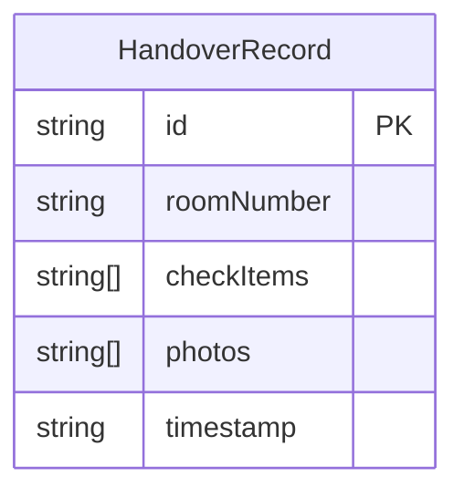

## 1. 架构设计

```mermaid
flowchart TD
    "前端 H5 应用" --> "localStorage 本地存储"
    "前端 H5 应用" --> "相机 API（拍照上传）"
```

纯前端应用，无后端服务，数据存储在浏览器 localStorage 中。

## 2. 技术说明
- 前端：React@18 + Tailwind CSS@3 + Vite
- 初始化工具：Vite（React + TypeScript 模板）
- 后端：无
- 数据库：无（使用 localStorage 模拟数据持久化）
- 外部服务：无

## 3. 路由定义
| 路由 | 用途 |
|------|------|
| / | 交接页（选房 → 勾检 → 拍照 → 提交） |
| /success | 提交成功页 |

## 4. API 定义
不适用（纯前端，无后端 API）

## 5. 服务器架构图
不适用（无后端服务）

## 6. 数据模型

### 6.1 数据模型定义



### 6.2 数据定义语言
```typescript
interface HandoverRecord {
  id: string
  roomNumber: string
  checkItems: string[]
  photos: string[]
  timestamp: string
}

interface CheckGroup {
  name: string
  emoji: string
  items: string[]
}

const CHECK_GROUPS: CheckGroup[] = [
  {
    name: '床品',
    emoji: '🛏️',
    items: ['被套更换', '床单平整', '枕套更换', '床垫无污渍']
  },
  {
    name: '卫浴',
    emoji: '🚿',
    items: ['马桶清洁', '淋浴间干净', '毛巾更换', '洗手台擦拭', '地漏无堵塞', '地面无积水']
  },
  {
    name: '厨房',
    emoji: '🍳',
    items: ['灶台清洁', '餐具已洗', '冰箱整洁', '垃圾桶清空']
  }
]

const ROOMS: string[] = [
  '101', '102', '103', '201', '202', '203', '301', '302', '303', '401', '402', '403'
]
```
