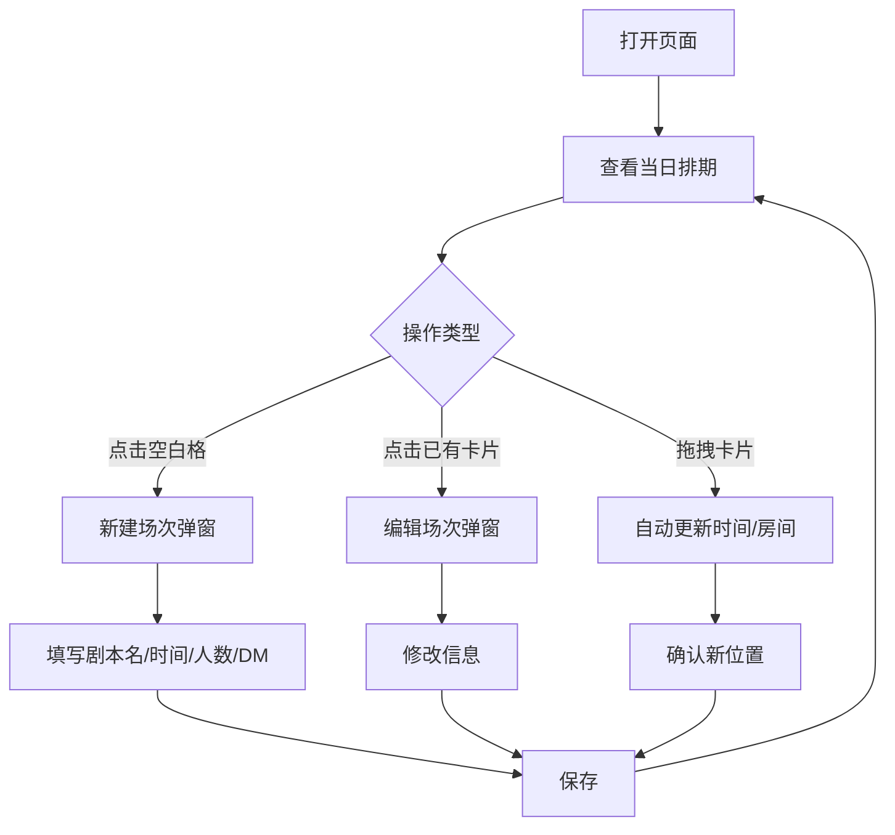

## 1. 产品概述
剧本杀门店前台排期管理系统，面向店长/前台人员，解决 6 个主题房间的场次排期可视化与快速编排问题。
- 核心价值：一目了然查看当日各房间开本情况，快速新建/编辑/拖拽调整场次，减少排期混乱与沟通成本

## 2. 核心功能

### 2.1 用户角色
| 角色 | 注册方式 | 核心权限 |
|------|----------|----------|
| 前台/店长 | 无需注册（单页应用） | 查看、新建、编辑、拖拽场次 |

### 2.2 功能模块
1. **日历排期页**：6 房间 × 时间轴日历视图、场次卡片、新建/编辑弹窗、拖拽改时

### 2.3 页面详情
| 页面名称 | 模块名称 | 功能描述 |
|----------|----------|----------|
| 日历排期页 | 时间轴日历网格 | 左侧 6 个房间列，顶部时间轴（10:00-02:00），格子内显示场次卡片 |
| 日历排期页 | 场次卡片 | 显示剧本名、开本时间、人数、DM 名，点击可编辑 |
| 日历排期页 | 新建/编辑弹窗 | 填写剧本名、开本时间、时长、人数、DM、房间；支持新建和修改 |
| 日历排期页 | 拖拽改时间 | 拖拽场次卡片到不同时间段或不同房间，自动更新时间 |
| 日历排期页 | 日期切换 | 顶部日期选择器，切换查看不同日期的排期 |
| 日历排期页 | 统计栏 | 显示当日总场次、总人数、各房间利用率 |

## 3. 核心流程

用户打开页面 → 查看当日 6 房间排期概览 → 点击空白格子新建场次 → 填写剧本/时间/人数/DM → 保存 → 场次卡片出现在日历中 → 可拖拽调整时间/房间 → 点击已有卡片编辑详情

## 4. 用户界面设计

### 4.1 设计风格
- **主色调**：深炭灰底 (#1a1a2e) + 琥珀金 (#f59e0b) 强调色，营造悬疑推理的沉浸氛围
- **辅助色**：各房间独立配色标签（6 种低饱和度色系），区分不同房间
- **字体**：标题用 Noto Serif SC（衬线，悬疑感），正文用 Noto Sans SC
- **布局**：左侧房间列固定，水平时间轴滚动；卡片式场次，圆角 + 半透明毛玻璃
- **图标**：lucide-react 图标库
- **动画**：卡片拖拽时放大 + 阴影增强；弹窗淡入缩放；悬停时卡片微微上浮

### 4.2 页面设计概述
| 页面名称 | 模块名称 | UI 元素 |
|----------|----------|----------|
| 日历排期页 | 顶部栏 | 日期选择器、当日统计、新建场次按钮 |
| 日历排期页 | 时间轴网格 | 6 行（房间）× 时间列，30 分钟一格，格子有细微边框 |
| 日历排期页 | 场次卡片 | 半透明背景、左侧房间色条、剧本名/时间/人数/DM |
| 日历排期页 | 新建/编辑弹窗 | 毛玻璃遮罩、居中弹窗、表单字段、保存/取消按钮 |

### 4.3 响应式
- 桌面优先，最小宽度 1280px
- 时间轴支持水平滚动
- 触屏支持拖拽（touch 事件）

### 4.4 3D 场景
- 不涉及
