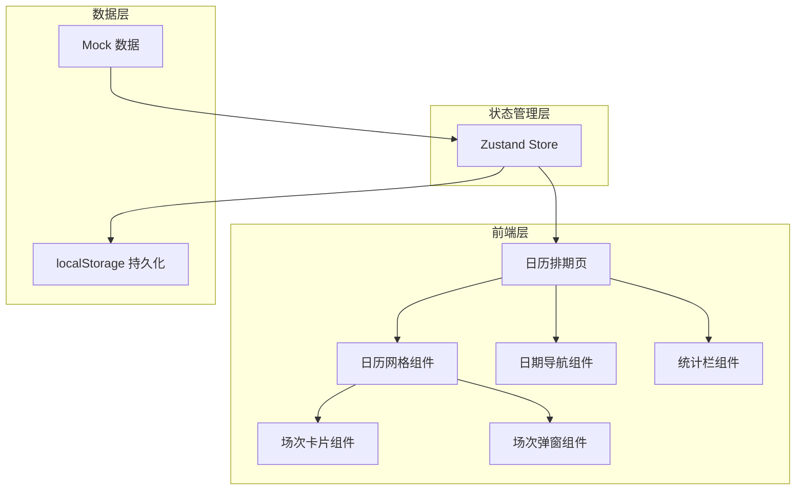
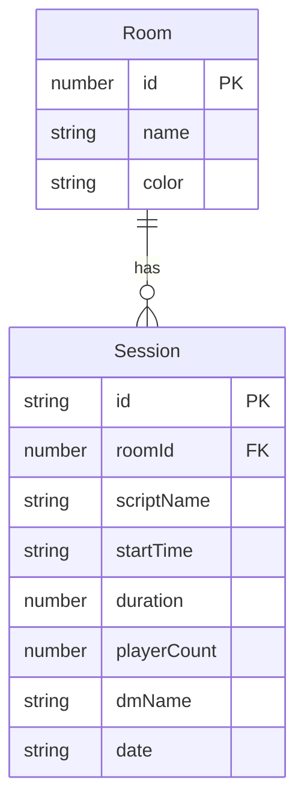

## 1. 架构设计



## 2. 技术说明
- 前端：React@18 + TypeScript + Tailwind CSS@3 + Vite
- 初始化工具：vite-init（react-ts 模板）
- 后端：无（纯前端，数据存 localStorage）
- 数据库：无（Mock 数据 + localStorage 持久化）

## 3. 路由定义
| 路由 | 用途 |
|------|------|
| / | 日历排期主页，展示 6 房间当日排期 |

## 4. API 定义
无后端 API，所有数据操作通过 Zustand Store 在前端完成，数据持久化至 localStorage。

### 数据类型定义

```typescript
interface Session {
  id: string
  roomId: number
  roomName: string
  scriptName: string
  startTime: string
  duration: number
  playerCount: number
  dmName: string
  date: string
}

interface Room {
  id: number
  name: string
  color: string
}

interface ScheduleState {
  sessions: Session[]
  selectedDate: string
  addSession: (session: Omit<Session, 'id'>) => void
  updateSession: (id: string, updates: Partial<Session>) => void
  deleteSession: (id: string) => void
  moveSession: (id: string, newRoomId: number, newStartTime: string) => void
  setSelectedDate: (date: string) => void
}
```

## 5. 服务器架构图
不涉及后端

## 6. 数据模型

### 6.1 数据模型定义



### 6.2 数据定义语言

```sql
-- 参考数据结构（实际使用 TypeScript + localStorage）
-- 房间初始数据
-- Room 1: 古风阁 (color: #8b5cf6)
-- Room 2: 密室区 (color: #06b6d4)
-- Room 3: 欧式厅 (color: #f59e0b)
-- Room 4: 日式屋 (color: #ef4444)
-- Room 5: 恐怖屋 (color: #10b981)
-- Room 6: 科幻舱 (color: #3b82f6)
```

## 7. 关键交互实现方案

### 7.1 日历网格
- 使用 CSS Grid 布局：6 行 × 34 列（10:00-02:00，每 30 分钟一格）
- 场次卡片绝对定位在对应格子位置，高度按 duration 计算
- 网格支持垂直滚动

### 7.2 拖拽改时间
- 使用 HTML5 Drag and Drop API
- 拖拽开始：记录场次 ID，卡片半透明
- 拖拽经过：高亮目标格子
- 拖拽放下：计算新房间和新时间，更新 Store
- 移动端：使用 touch 事件模拟拖拽

### 7.3 数据持久化
- Zustand Store 配置 persist 中间件
- 数据自动同步到 localStorage
- 页面刷新后自动恢复
