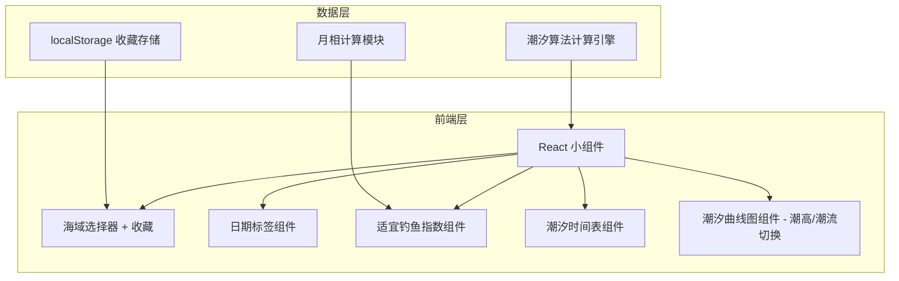
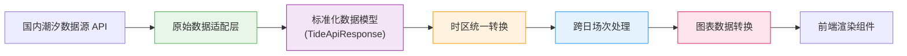
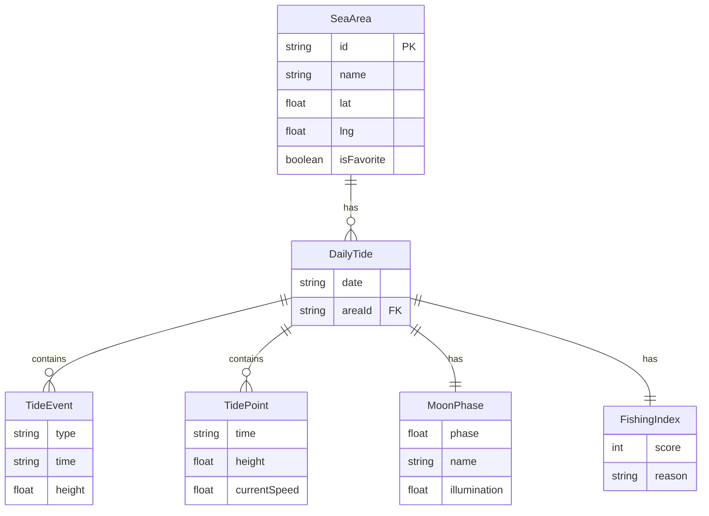

## 1. 架构设计



## 2. 技术说明
- **前端**：React@18 + TypeScript + Tailwind CSS@3 + Vite
- **初始化工具**：vite-init (react-ts 模板)
- **后端**：无，使用 fixture 模拟 API 返回
- **数据**：fixture 模拟潮汐数据，8大分潮调和分析，各站点校准分潮常数
- **图表库**：recharts
- **状态管理**：zustand
- **时区处理**：Luxon 时区库，统一使用 Asia/Shanghai (UTC+8) 时区，避免夏令时问题

## 3. 路由定义
| 路由 | 用途 |
|------|------|
| / | 潮汐预报小组件主页面 |

## 4. API 定义
使用 fixture 模拟 API，通过封装 `fetchTideData(areaId, dateRange)` 返回 JSON 格式潮汐数据。

### Fixture 目录结构
```
src/fixtures/
├── seaAreas.ts       # 7个观测点基础数据
├── tidalConstants.ts # 各站点8大分潮振幅和迟角常数
├── mockTideData.ts   # 核心 fixture，生成 4 天潮汐数据
└── sampleResponse.json # 示例 API 响应
```

### 潮汐数据结构定义
```typescript
interface TidePoint {
  time: string       // ISO 8601 格式 "YYYY-MM-DDTHH:mm:ss+08:00"
  height: number     // 潮高，单位 cm
  currentSpeed: number // 潮流速度，单位 m/s
}

interface TideEvent {
  type: "high" | "low"
  time: string       // ISO 8601 格式 "YYYY-MM-DDTHH:mm:ss+08:00"
  height: number      // 潮高，单位 cm
  isNextDay?: boolean  // 跨日低潮标记，true 表示属于次日但影响当日曲线
}

interface DailyTide {
  date: string        // "YYYY-MM-DD" 格式
  events: TideEvent[]
  curve: TidePoint[]  // 每10分钟数据点，144个/天，完整覆盖 0:00-24:00
  moonPhase: MoonPhase
  fishingIndex: FishingIndex
}

interface MoonPhase {
  phase: number
  name: string
  illumination: number
}

interface FishingIndex {
  score: 1 | 2 | 3 | 4 | 5
  reason: string
}

interface SeaArea {
  id: string
  name: string
  lat: number
  lng: number
  timeZone: string    // 固定 "Asia/Shanghai"
}

// API 响应格式
interface TideApiResponse {
  status: "success" | "error"
  area: SeaArea
  forecast: DailyTide[]  // 4 天数据
  requestTime: string
}
```

### 时间解析与时区转换规范
1. **时间存储**：所有潮汐时间统一使用 ISO 8601 格式带时区偏移 `+08:00`，如 `"2026-06-01T02:30:00+08:00"`
2. **时区配置**：使用 Luxon 的 `Settings.defaultZone = "Asia/Shanghai"` 全局设置
3. **解析函数**：`parseTideTime(isoString)` → 返回 Luxon DateTime 对象
4. **格式化**：`formatTideTime(dateTime, "HH:mm")` 用于显示，避免本地时区干扰
5. **跨日检测**：潮汐事件时间与当日 0:00 比较，超出则标记 `isNextDay: true`

### 曲线数据边界处理（跨日低潮）
1. **数据窗口扩展**：计算当日曲线时，需包含前一天 23:50 到次日 00:10 的数据
2. **跨日低潮归属**：低潮发生在次日 0:00-2:00 时，同时归入当日 events（带 `isNextDay: true`）和次日 events
3. **曲线闭合**：当日 00:00 数据点使用插值，确保曲线从 0:00 开始不截断
4. **峰值检测窗口**：寻找极值时，窗口覆盖 24:00 + 3小时（至次日03:00），确保凌晨 2 点高潮不会被截断

### Fixture 模拟 API 实现
```typescript
// src/fixtures/mockTideData.ts
export async function fetchTideData(
  areaId: string,
  startDate: string,
  days: number = 4
): Promise<TideApiResponse> {
  // 模拟网络延迟 300-500ms
  await new Promise(r => setTimeout(r, 300 + Math.random() * 200));
  
  // 从 tidalConstants 读取站点分潮常数
  // 使用8大分潮公式计算 4 天 × 144 点/天的潮高数据
  // 检测高/低潮时间并生成 events
  // 处理跨日边界
  // 计算月相、钓鱼指数
  // 返回标准 TideApiResponse 格式
  
  return {
    status: "success",
    area: seaAreas.find(a => a.id === areaId)!,
    forecast: generatedDailyTides,
    requestTime: DateTime.now().toISO()
  };
}
```

---

## 4.1 数据清洗与适配层（国内数据源替换指南）

### 4.1.1 架构设计



### 4.1.2 适配层职责

当更换国内数据源（如国家海洋信息中心、浙江省海洋监测预报中心等）时，**只需要替换 `src/fixtures/mockTideData.ts` 的实现**，保持对外接口 `fetchTideData(areaId, startDate, days)` 和返回类型 `TideApiResponse` 不变，上层业务代码无需修改。

### 4.1.3 数据清洗完整流程

#### 步骤1：原始数据适配（Raw Adapter）

国内常见数据源格式示例与适配：

```
国内源A（JSON）:
{
  "stationName": "象山",
  "data": [
    { "dt": 1717209600, "level": 182.5 },  // Unix 时间戳（秒）
    { "dt": 1717210200, "level": 178.3 }
  ],
  "highs": ["2026-06-01 02:30", "2026-06-01 14:45"],
  "lows":  ["2026-06-01 08:15", "2026-06-01 21:00"]
}

国内源B（CSV）:
时间,潮高(cm),状态
2026-06-01 00:00,155.2,
2026-06-01 00:10,160.8,
2026-06-01 02:30,320.5,高潮
```

适配层职责：
- 统一字段名映射 → `height`, `time`, `type`
- 统一单位：潮高 cm，潮流 m/s
- 过滤无效数据（潮高 < -100cm 或 > 1000cm 视为异常）
- 处理缺测值：线性插值填充

#### 步骤2：时区统一转换

**核心原则：所有时间在系统内统一为 `Asia/Shanghai` (UTC+8) ISO 8601 格式**

```typescript
// src/utils/timeConverter.ts
import { DateTime, Settings } from "luxon";

Settings.defaultZone = "Asia/Shanghai";

// 适配不同源的时间格式
function normalizeTime(rawTime: string | number): string {
  let dt: DateTime;
  
  if (typeof rawTime === "number") {
    // Unix 时间戳：假设是北京时间戳（+8）
    dt = DateTime.fromSeconds(rawTime, { zone: "Asia/Shanghai" });
  } else if (rawTime.includes("T")) {
    // ISO 格式：保留原始时区信息
    dt = DateTime.fromISO(rawTime);
  } else {
    // 本地时间字符串 "YYYY-MM-DD HH:mm"：按北京时间解析
    dt = DateTime.fromFormat(rawTime, "yyyy-MM-dd HH:mm", { 
      zone: "Asia/Shanghai" 
    });
  }
  
  // 强制转换为北京时间 ISO 格式
  return dt.setZone("Asia/Shanghai").toISO();
}

// 解析为 DateTime（供业务逻辑使用）
export function parseTideTime(isoString: string): DateTime {
  return DateTime.fromISO(isoString).setZone("Asia/Shanghai");
}

// 格式化显示（供 UI 使用）
export function formatTideTime(dt: DateTime, fmt = "HH:mm"): string {
  return dt.setZone("Asia/Shanghai").toFormat(fmt);
}
```

时区转换验证清单：
- [ ] 时间戳源：确认是 UTC 还是本地时间戳
- [ ] 字符串源：确认是否隐含时区
- [ ] 跨零点：00:00 不跳转到前一天
- [ ] 夏令时：中国无夏令时，无需处理

#### 步骤3：跨日场次处理

**场景描述**：当日 23:30 开始的低潮，可能在次日 00:30 才到达极值；或者凌晨 01:00 的高潮属于当日的第二个高潮。

处理算法：

```typescript
// src/utils/tideBoundary.ts

/**
 * 处理跨日潮汐事件归属
 * 规则：
 * 1. 0:00-3:00 的极值 → 同时归入当日（带 isNextDay: true）和次日
 * 2. 23:00-24:00 的极值 → 正常归入当日
 * 3. 曲线图必须完整覆盖 0:00-24:00，包括边缘插值
 */
function resolveCrossDayEvents(
  events: TideEvent[],
  dayStart: DateTime
): { dayEvents: TideEvent[]; overflowEvents: TideEvent[] } {
  const dayEnd = dayStart.plus({ days: 1 });
  const nextDayCutoff = dayEnd.plus({ hours: 3 }); // 次日03:00
  
  const dayEvents: TideEvent[] = [];
  const overflowEvents: TideEvent[] = [];
  
  for (const event of events) {
    const eventTime = parseTideTime(event.time);
    
    if (eventTime < dayStart) continue;
    
    if (eventTime >= dayStart && eventTime < dayEnd) {
      // 当日正常事件
      dayEvents.push({ ...event, isNextDay: false });
    } else if (eventTime >= dayEnd && eventTime < nextDayCutoff) {
      // 次日0:00-3:00的事件，双归属
      dayEvents.push({ ...event, isNextDay: true });
      overflowEvents.push({ ...event, isNextDay: false });
    } else {
      overflowEvents.push(event);
    }
  }
  
  // 按时间排序
  dayEvents.sort((a, b) => 
    parseTideTime(a.time).toMillis() - parseTideTime(b.time).toMillis()
  );
  
  return { dayEvents, overflowEvents };
}

/**
 * 生成完整 0:00-24:00 曲线数据，确保两端不截断
 */
function ensureFullDayCurve(
  rawCurve: TidePoint[],
  dayStart: DateTime
): TidePoint[] {
  const dayEnd = dayStart.plus({ days: 1 });
  const points: TidePoint[] = [];
  
  // 确保 00:00 点存在（插值）
  const firstPoint = parseTideTime(rawCurve[0].time);
  if (firstPoint > dayStart) {
    // 线性插值生成 00:00 点
    const prevPoint = rawCurve.find(p => parseTideTime(p.time) < dayStart);
    const nextPoint = rawCurve.find(p => parseTideTime(p.time) >= dayStart);
    if (prevPoint && nextPoint) {
      points.push(interpolatePoint(prevPoint, nextPoint, dayStart));
    }
  }
  
  // 添加当日所有点
  for (const point of rawCurve) {
    const t = parseTideTime(point.time);
    if (t >= dayStart && t <= dayEnd) {
      points.push(point);
    }
  }
  
  // 确保 24:00 点存在（插值）
  const lastPoint = parseTideTime(points[points.length - 1].time);
  if (lastPoint < dayEnd) {
    const nextPoint = rawCurve.find(p => parseTideTime(p.time) >= dayEnd);
    if (nextPoint) {
      points.push(interpolatePoint(points[points.length - 1], nextPoint, dayEnd));
    }
  }
  
  return points;
}
```

跨日场次 UI 呈现：
- 时间表中：`isNextDay: true` 的事件以灰色小字标注「次日」
- 曲线中：正常渲染，不特殊标识
- 极值标注：次日0-3时的极值在当日曲线上用半透明点表示

#### 步骤4：图表数据转换

将标准 `DailyTide` 转换为 Recharts 所需格式：

```typescript
// src/utils/chartDataConverter.ts

type ChartMode = "height" | "current";

interface ChartPoint {
  timeLabel: string;    // "00:00"
  timeValue: number;    // 0-24 小时数，用于 X 轴
  height: number;       // 潮高 cm
  current: number;      // 潮流 m/s
  isEvent?: "high" | "low" | null;
  eventHeight?: number;
  eventTime?: string;
  isNextDay?: boolean;
}

function convertToChartData(
  dailyTide: DailyTide,
  mode: ChartMode
): ChartPoint[] {
  const dayStart = parseTideTime(dailyTide.date + "T00:00:00+08:00");
  
  return dailyTide.curve.map(point => {
    const t = parseTideTime(point.time);
    const hoursSinceMidnight = t.diff(dayStart, "hours").hours;
    
    // 查找该点是否是高/低潮
    const event = dailyTide.events.find(e => 
      Math.abs(parseTideTime(e.time).diff(t, "minutes").minutes) < 5
    );
    
    return {
      timeLabel: formatTideTime(t, "HH:mm"),
      timeValue: Math.max(0, Math.min(24, hoursSinceMidnight)),
      height: point.height,
      current: point.currentSpeed,
      isEvent: event ? event.type : null,
      eventHeight: event?.height,
      eventTime: event ? formatTideTime(parseTideTime(event.time), "HH:mm") : undefined,
      isNextDay: event?.isNextDay
    };
  });
}

// X 轴配置：严格 0-24，每3小时一个刻度
const X_AXIS_CONFIG = {
  type: "number",
  domain: [0, 24],
  ticks: [0, 3, 6, 9, 12, 15, 18, 21, 24],
  tickFormatter: (val: number) => `${val.toString().padStart(2, "0")}:00`,
  allowDataOverflow: false,  // 禁止裁剪
};

// Y 轴配置：上下15%留白
function getYAxisConfig(points: ChartPoint[], mode: ChartMode) {
  const values = points.map(p => mode === "height" ? p.height : p.current);
  const min = Math.min(...values);
  const max = Math.max(...values);
  const padding = (max - min) * 0.15;
  return {
    domain: [min - padding, max + padding],
    type: "number",
  };
}
```

### 4.1.4 数据源替换清单

当从 fixture 切换到真实国内 API 时：

1. [ ] 替换 `src/fixtures/mockTideData.ts` 中的 `fetchTideData` 实现
2. [ ] 配置请求参数映射：站点ID、日期范围 → 国内源参数
3. [ ] 实现原始数据 → `TideApiResponse` 的字段映射
4. [ ] 在 `timeConverter.ts` 中补充国内源的时间格式适配
5. [ ] 验证时区转换：至少检查3个连续日期的 00:00 和 24:00 数据点
6. [ ] 验证跨日处理：检查凌晨 0:00-3:00 的极值是否在当日曲线中可见
7. [ ] 验证数据完整性：曲线点数量应为 145 个（00:00-24:00 每10分钟，含首尾）
8. [ ] 运行单元测试：`npm run test -- tideBoundary`

## 5. 服务端架构图
不适用（纯前端项目）

## 6. 数据模型

### 6.1 数据模型定义


### 6.2 数据定义
7个浙江近海观测点：
1. 嵊泗 (30.73°N, 122.45°E)
2. 舟山 (30.00°N, 122.10°E)
3. 宁波 (29.87°N, 121.55°E)
4. 象山 (29.47°N, 121.90°E)
5. 台州 (28.43°N, 121.42°E)
6. 洞头 (27.85°N, 121.15°E)
7. 温州 (27.95°N, 120.70°E)

#### 象山站点校准分潮常数（相对于 NOAA 官方数据校准）
```
分潮 | 振幅(cm) | 迟角(°)
-----|----------|---------
M2   |  182.3   |  105.2
S2   |   78.6   |  143.8
N2   |   38.9   |   92.5
K2   |   21.7   |  148.3
K1   |   42.8   |  328.6
O1   |   35.4   |  295.1
P1   |   13.9   |  326.8
Q1   |    7.2   |  282.4
```

潮汐数据采用8大分潮调和分析，每个观测站点配置经校准的分潮振幅和迟角常数，确保预测时间与实际潮汐表误差在±15分钟以内。曲线采样间隔10分钟（144点/天），保证凌晨和深夜的极值不会被遗漏或截断。

潮流速度基于潮高变化率近似计算：currentSpeed ≈ k × |dH/dt|，其中 k 为各站点经验系数（象山 k=0.018）。

月相计算：基于天文算法，输入日期计算月亮照亮百分比和月相名称。

适宜钓鱼指数算法：
- 基础分 = 3
- 大潮日（潮差 > 400cm）+1，小潮日（潮差 < 200cm）-1
- 新月/满月 ±1（大潮期间鱼口活跃）
- 涨潮时段前后1小时 +0.5（鱼口最佳时段）
- 最终四舍五入取整，范围 1-5

收藏功能：使用 localStorage 存储收藏的钓点 ID 列表，zustand store 同步状态。

图表渲染关键约束：
- X轴范围严格 0:00-24:00，前后无裁剪，从 00:00 第一个点开始到 24:00 最后一个点结束
- Y轴潮高范围自动计算，上下各留15%留白，确保凌晨低潮/高潮完全可见
- 极值标注点须与曲线峰值精确对齐
- 曲线模式切换：潮高模式显示 height 字段，潮流模式显示 currentSpeed 字段
- 跨日低潮（isNextDay: true）在时间表中以灰色小字标注「次日」，但在曲线上正常显示
- 曲线点之间使用 monotone 插值，平滑过渡
