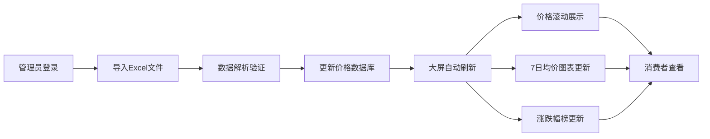

## 1. 产品概述
农贸市场价格公示大屏系统，用于实时展示各摊位当日菜品价格、7日均价趋势和价格涨跌幅排行。解决农贸市场价格不透明、信息更新不及时的问题，提升市场管理效率和消费者体验。

## 2. 核心功能

### 2.1 用户角色
| 角色 | 使用方式 | 核心权限 |
|------|----------|----------|
| 市场管理员 | 后台导入数据 | Excel数据导入、价格管理 |
| 消费者/摊主 | 大屏查看 | 浏览价格信息、涨跌幅、历史趋势 |

### 2.2 功能模块
1. **价格滚动展示区**：20个品类菜价滚动轮播，显示摊位号、品名、今日价格、单位
2. **7日均价折线图**：展示选中菜品近7天价格趋势
3. **涨跌幅排行榜**：分别展示涨幅榜和跌幅榜，TOP5菜品
4. **数据导入模块**：管理员通过Excel导入当日价格数据
5. **自动轮播系统**：1080p全屏展示，页面自动轮播切换

### 2.3 页面详情
| 页面名称 | 模块名称 | 功能描述 |
|---------|----------|----------|
| 大屏主页 | 价格滚动区 | 垂直滚动展示20个品类价格，支持暂停/继续 |
| 大屏主页 | 7日均价图 | 交互式折线图，鼠标悬停显示具体价格 |
| 大屏主页 | 涨跌幅榜 | 左右分栏展示涨幅TOP5和跌幅TOP5 |
| 大屏主页 | 顶部标题栏 | 市场名称、当前日期时间、今日天气 |
| 管理后台 | Excel导入 | 上传Excel文件，解析并更新价格数据 |

## 3. 核心流程
管理员每日早市前通过管理后台导入Excel价格数据 → 系统解析数据并更新数据库 → 大屏自动加载最新数据 → 1080p全屏自动轮播展示 → 消费者和摊主实时查看价格信息

## 4. 用户界面设计

### 4.1 设计风格
- **主色调**：市场绿 (#2E7D32) + 丰收橙 (#FF8F00)
- **辅助色**：涨幅红 (#E53935)、跌幅绿 (#43A047)、中性灰 (#F5F5F5)
- **字体**：大号数字使用粗体无衬线字体，正文使用清晰易读的系统字体
- **布局风格**：三栏式卡片布局，深色背景配亮色数据卡片
- **图标风格**：简洁线性图标，菜品使用emoji图标增强识别度

### 4.2 页面设计概览
| 页面名称 | 模块名称 | UI元素 |
|---------|----------|--------|
| 大屏主页 | 价格滚动区 | 深色渐变背景，白色卡片，价格高亮，滚动动画 |
| 大屏主页 | 7日均价图 | 折线图带渐变填充，数据点悬停提示，品类切换标签 |
| 大屏主页 | 涨跌幅榜 | 红绿色区分涨跌，箭头图标指示趋势，数字放大显示 |
| 大屏主页 | 顶部标题 | 大字体市场名称，实时时钟，天气图标 |

### 4.3 响应式
- 桌面优先：1920×1080 (1080p) 全屏优化
- 自适应：支持不同分辨率显示器
- 触控优化：大屏触控交互支持

### 4.4 动效设计
- 价格滚动：平滑垂直滚动，每5秒滚动一屏
- 数据更新：数字变化过渡动画
- 图表加载：渐入动画
- 页面轮播：平滑淡入淡出切换效果
