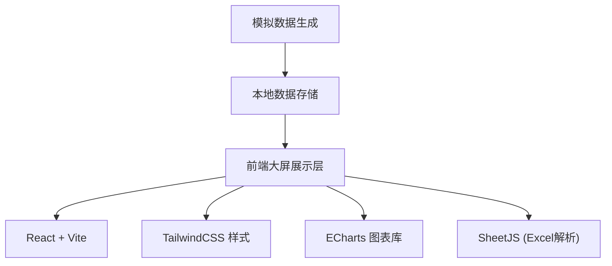

## 1. 架构设计



## 2. 技术描述
- **前端框架**：React@18 + Vite@5
- **样式方案**：TailwindCSS@3
- **图表库**：ECharts@5
- **Excel解析**：xlsx (SheetJS)
- **数据存储**：LocalStorage（前端本地存储）
- **初始化工具**：npm create vite@latest

## 3. 路由定义
| 路由 | 用途 |
|------|------|
| / | 大屏主页 - 价格公示大屏 |
| /admin | 管理后台 - Excel数据导入 |

## 4. 数据模型

### 4.1 菜品价格数据定义

```typescript
// 单条价格记录
interface PriceRecord {
  id: string;
  category: string;      // 品类名称
  categoryIcon: string;   // 品类图标emoji
  stallNumber: string;    // 摊位号
  price: number;          // 今日价格
  unit: string;           // 单位 (元/斤)
  yesterdayPrice: number; // 昨日价格
  change: number;         // 涨跌幅 (%)
  history7Days: number[]; // 7日历史价格
}

// 每日数据快照
interface DailyData {
  date: string;           // 日期 YYYY-MM-DD
  records: PriceRecord[];
  updatedAt: string;      // 更新时间
}
```

### 4.2 20个品类清单
1. 白菜 🥬
2. 猪肉 🥩
3. 牛肉 🥩
4. 鸡肉 🍗
5. 鸡蛋 🥚
6. 西红柿 🍅
7. 黄瓜 🥒
8. 土豆 🥔
9. 胡萝卜 🥕
10. 洋葱 🧅
11. 青椒 🫑
12. 茄子 🍆
13. 豆角 🫘
14. 菠菜 🥬
15. 生菜 🥬
16. 苹果 🍎
17. 香蕉 🍌
18. 橘子 🍊
19. 西瓜 🍉
20. 大米 🍚

## 5. 核心组件结构

```
src/
├── components/
│   ├── Header.tsx          # 顶部标题栏
│   ├── PriceScroll.tsx     # 价格滚动展示区
│   ├── PriceChart.tsx      # 7日均价折线图
│   ├── RankList.tsx        # 涨跌幅排行榜
│   └── ExcelImport.tsx     # Excel导入组件
├── pages/
│   ├── Dashboard.tsx       # 大屏主页
│   └── Admin.tsx           # 管理后台
├── data/
│   └── mockData.ts         # 模拟数据
├── utils/
│   ├── excelParser.ts      # Excel解析工具
│   └── storage.ts          # 本地存储工具
├── App.tsx
├── main.tsx
└── index.css
```

## 6. 功能实现要点

### 6.1 自动轮播实现
- 使用CSS动画实现价格列表垂直滚动
- 每5秒自动切换图表展示的品类
- 全屏模式支持 (Fullscreen API)

### 6.2 Excel导入流程
1. 管理员上传.xlsx文件
2. SheetJS解析文件内容
3. 数据格式验证
4. 更新LocalStorage存储
5. 大屏自动刷新数据

### 6.3 图表交互
- ECharts实现折线图
- 支持品类切换
- 悬停显示详情
- 自适应容器大小

### 6.4 响应式适配
- 基础分辨率：1920×1080
- 使用vw/vh单位适配不同屏幕
- 触控设备支持
