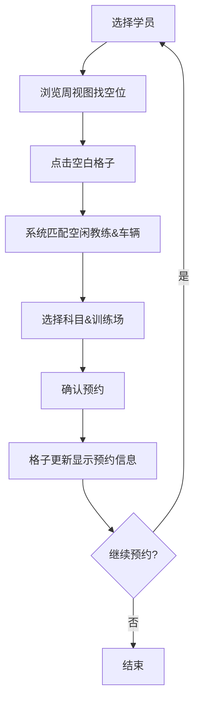

## 1. 产品概述
驾校智能排课预约系统——帮助学员快速预约练车时段，自动匹配空闲教练与车辆，避免冲突，提升驾校排课效率。
- 目标用户：驾校管理员/前台，负责为学员安排练车时段
- 核心价值：可视化周视图一目了然，一键预约告别手动排课冲突

## 2. 核心功能

### 2.1 用户角色
| 角色 | 注册方式 | 核心权限 |
|------|----------|----------|
| 管理员 | 系统预设 | 查看学员、教练、车辆，执行预约/取消操作 |

### 2.2 功能模块
1. **排课主页**：左侧学员列表 + 右侧周视图排课格子，预约与展示

### 2.3 页面详情
| 页面名称 | 模块名称 | 功能描述 |
|----------|----------|----------|
| 排课主页 | 学员列表面板 | 展示学员姓名、在学科目（科目二/科目三），点击选中当前预约学员 |
| 排课主页 | 周视图排课面板 | 横轴为周一至周日，纵轴为8:00-20:00时段（每小时一格），格子内展示教练+车辆+训练场 |
| 排课主页 | 预约操作 | 选中学员后点击空白格子预约1小时，弹出选择教练/车辆/科目/训练场的确认弹窗 |
| 排课主页 | 已约展示 | 已预约格子显示学员姓名、科目类型（科目二/科目三）、训练场名称 |
| 排课主页 | 取消预约 | 点击已预约格子可取消该次预约 |

## 3. 核心流程
管理员选中左侧学员 → 在右侧周视图中找到空白时段格子 → 点击空白格子 → 系统自动推荐该时段空闲的教练和车辆 → 确认科目与训练场 → 完成预约 → 格子更新显示预约信息

## 4. 用户界面设计

### 4.1 设计风格
- 主色调：深青色 (#0F766E) + 琥珀色点缀 (#F59E0B)，驾校专业沉稳感
- 辅助色：浅灰背景、白色卡片、科目二用蓝色标签、科目三用橙色标签
- 字体：Noto Sans SC（中文场景最佳可读性）
- 布局：左右分栏，左侧窄面板 + 右侧宽格子区域
- 按钮：圆角按钮，预约确认用实心主色，取消用描边样式
- 图标：Lucide Icons 线性风格

### 4.2 页面设计概览
| 页面名称 | 模块名称 | UI元素 |
|----------|----------|--------|
| 排课主页 | 学员列表面板 | 左侧固定宽度280px，搜索框+学员卡片列表，选中高亮 |
| 排课主页 | 周视图排课面板 | 右侧7列×12行网格，顶部星期标题行，左侧时间轴，格子内标签式信息展示 |
| 排课主页 | 预约确认弹窗 | 居中弹窗，教练下拉选择、车辆下拉选择、科目单选、训练场下拉选择、确认/取消按钮 |
| 排课主页 | 周切换导航 | 周视图上方，上一周/下一周箭头+当前周日期范围显示 |

### 4.3 响应式
- 桌面优先设计，最小宽度1280px
- 小屏幕下学员面板可折叠为抽屉

### 4.4 3D场景指引
- 不适用
