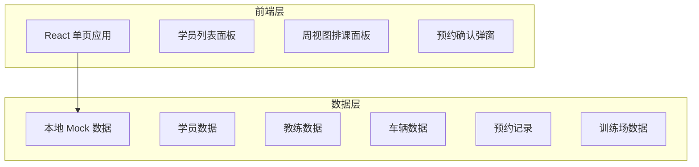
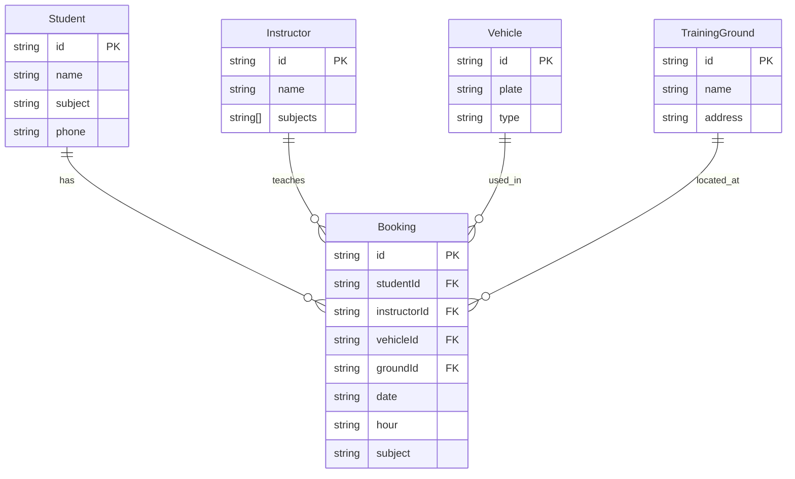

## 1. 架构设计



## 2. 技术说明
- 前端：React@18 + Tailwind CSS@3 + Vite
- 初始化工具：Vite
- 后端：无（纯前端 + Mock 数据）
- 数据库：无（使用内存中的 Mock 数据）

## 3. 路由定义
| 路由 | 用途 |
|------|------|
| / | 排课主页，包含学员列表和周视图 |

## 4. API 定义
不适用——纯前端项目，数据存储在组件 state 中。

## 5. 服务器架构图
不适用——无后端服务。

## 6. 数据模型

### 6.1 数据模型定义



### 6.2 数据定义

核心数据结构（TypeScript 类型）：

```typescript
type Subject = "科目二" | "科目三";

interface Student {
  id: string;
  name: string;
  subject: Subject;
  phone: string;
}

interface Instructor {
  id: string;
  name: string;
  subjects: Subject[];
}

interface Vehicle {
  id: string;
  plate: string;
  type: string;
}

interface TrainingGround {
  id: string;
  name: string;
  address: string;
}

interface Booking {
  id: string;
  studentId: string;
  instructorId: string;
  vehicleId: string;
  groundId: string;
  date: string;      // YYYY-MM-DD
  hour: number;       // 8-19 (表示8:00-9:00等)
  subject: Subject;
}
```
