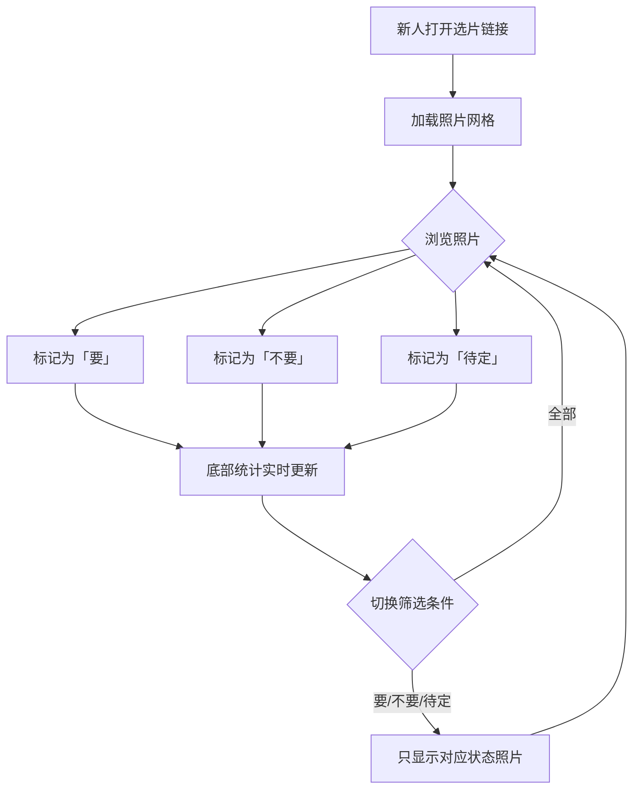

## 1. 产品概述

婚礼摄影师为新人生成的在线选片门户。新人可在缩略图网格中浏览婚礼照片，标记每张照片为「要」「不要」「待定」，底部实时显示已选数量与统计。
- 解决问题：替代传统线下选片或微信群传图，提供优雅、专注的在线选片体验
- 目标用户：婚礼摄影师（上传照片）与新人（浏览并选片）

## 2. 核心功能

### 2.1 用户角色

| 角色 | 进入方式 | 核心权限 |
|------|----------|----------|
| 新人 | 摄影师分享链接 | 浏览照片、标记选片状态、查看统计 |
| 摄影师 | 后台管理（本期暂不实现） | 上传照片、管理项目 |

### 2.2 功能模块

1. **选片页面**：照片缩略图网格、状态标记（要/不要/待定）、底部统计栏

### 2.3 页面详情

| 页面名称 | 模块名称 | 功能描述 |
|----------|----------|----------|
| 选片页面 | 顶部欢迎栏 | 展示新人姓名、婚礼日期、温馨寄语 |
| 选片页面 | 筛选工具栏 | 按标记状态筛选：全部/要/不要/待定 |
| 选片页面 | 照片网格 | 缩略图瀑布流/网格展示，点击可标记状态 |
| 选片页面 | 照片卡片 | 单张照片展示，三个状态按钮（要/不要/待定），状态高亮 |
| 选片页面 | 底部统计栏 | 固定底部，显示「要」「不要」「待定」数量及总照片数 |

## 3. 核心流程

## 4. 用户界面设计

### 4.1 设计风格

- **主色调**：纯白 #FFFFFF + 柔灰 #F5F0EB（暖白），点缀玫瑰金 #C9A96E
- **辅助色**：浅鼠尾草绿 #D4C5B9（「要」状态）、柔粉 #F0D5D5（「待定」状态）、淡灰 #E5E0DB（「不要」状态）
- **按钮风格**：圆润胶囊型，hover 时微上浮 + 柔和阴影
- **字体**：标题使用 Playfair Display（衬线优雅体），正文使用 Lato（简洁无衬线体）
- **布局风格**：居中内容区、大留白、卡片带圆角阴影
- **图标风格**：Lucide 线性图标，纤细优雅
- **整体氛围**：白色婚礼风——干净、优雅、浪漫、呼吸感

### 4.2 页面设计概览

| 页面名称 | 模块名称 | UI 元素 |
|----------|----------|----------|
| 选片页面 | 顶部欢迎栏 | Playfair Display 大标题，暖白背景，玫瑰金分割线 |
| 选片页面 | 筛选工具栏 | 胶囊按钮组，选中态玫瑰金底色 |
| 选片页面 | 照片网格 | 3列等宽网格（桌面），2列（平板），1列（手机），圆角卡片 + 柔和阴影 |
| 选片页面 | 照片卡片 | 照片占满卡片宽度，下方三个胶囊状态按钮，选中态高亮 |
| 选片页面 | 底部统计栏 | 固定底部，毛玻璃背景，三组统计数字 + 标签 |

### 4.3 响应式设计

- 桌面端优先（3列网格）
- 平板适配（2列网格）
- 手机适配（1-2列网格），触摸优化（按钮足够大）
- 底部统计栏始终固定在视口底部

### 4.4 移动端触摸优化

- **禁用双击放大**：全局 `touch-action: manipulation`，照片卡片上 `touch-action: none` 防止浏览器默认双击缩放行为
- **防误触**：状态按钮最小触摸目标 44×44px，按钮间距充足
- **触摸反馈**：触摸按下时按钮即时变色反馈，不依赖 hover
- **阻止图片长按保存弹窗**：照片 img 上 `pointer-events: none`，交互全部由父容器处理

### 4.5 性能优化（200+ 照片）

- **虚拟滚动**：使用 `@tanstack/react-virtual` 仅渲染可视区域内的照片卡片，避免 200+ DOM 节点同时存在
- **图片懒加载**：`` + Intersection Observer，非可视区图片不加载
- **状态更新优化**：Zustand selector 精确订阅，PhotoCard 仅在自身状态变化时重渲染
- **图片占位**：加载中显示骨架屏，避免布局抖动

### 4.6 动画与交互

- 照片卡片加载时：淡入 + 微上浮（staggered）
- 状态切换：按钮颜色过渡 + 轻微缩放弹性
- 筛选切换：网格平滑重排（CSS transition）
- 底部统计数字变化：数字跳动微动画
