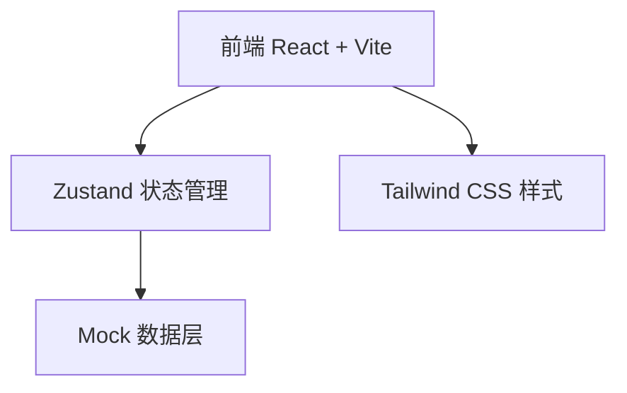

## 1. 架构设计



纯前端项目，使用 Mock 假数据跑通全部流程，无需后端服务。

## 2. 技术说明

- **前端框架**：React 18 + TypeScript
- **构建工具**：Vite
- **样式方案**：Tailwind CSS 3
- **状态管理**：Zustand
- **路由**：React Router DOM（本期单页，预留扩展）
- **图标**：Lucide React
- **动画**：CSS Transitions + CSS Keyframes（轻量方案）
- **虚拟滚动**：@tanstack/react-virtual（200+ 照片性能保障）
- **数据层**：前端 Mock 假数据，照片使用占位图

## 3. 路由定义

| 路由 | 用途 |
|------|------|
| / | 选片主页面 |

## 4. API 定义

本期无后端 API，全部使用前端 Mock 数据。

照片数据结构：

```typescript
interface Photo {
  id: string
  src: string
  thumbnailSrc: string
  status: 'selected' | 'rejected' | 'undecided'
  order: number
}

interface SelectionStore {
  photos: Photo[]
  filter: 'all' | 'selected' | 'rejected' | 'undecided'
  setPhotoStatus: (id: string, status: Photo['status']) => void
  setFilter: (filter: SelectionStore['filter']) => void
  counts: { selected: number; rejected: number; undecided: number; total: number }
}
```

## 5. 项目结构

```
src/
  components/
    PhotoCard.tsx       # 单张照片卡片
    PhotoGrid.tsx       # 照片网格（含虚拟滚动）
    FilterBar.tsx       # 筛选工具栏
    StatsBar.tsx        # 底部统计栏
    WelcomeBanner.tsx   # 顶部欢迎栏
  hooks/
    useTouchInteraction.ts  # 触摸防误触 Hook
  store/
    useSelectionStore.ts  # Zustand 状态管理
  data/
    mockPhotos.ts       # Mock 假数据
  pages/
    SelectionPage.tsx   # 选片主页面
  App.tsx
  main.tsx
  index.css
```

## 6. 数据模型

本期使用前端 Zustand Store 管理 Mock 数据，无数据库。照片使用 picsum.photos 或同类型占位图服务生成缩略图。
