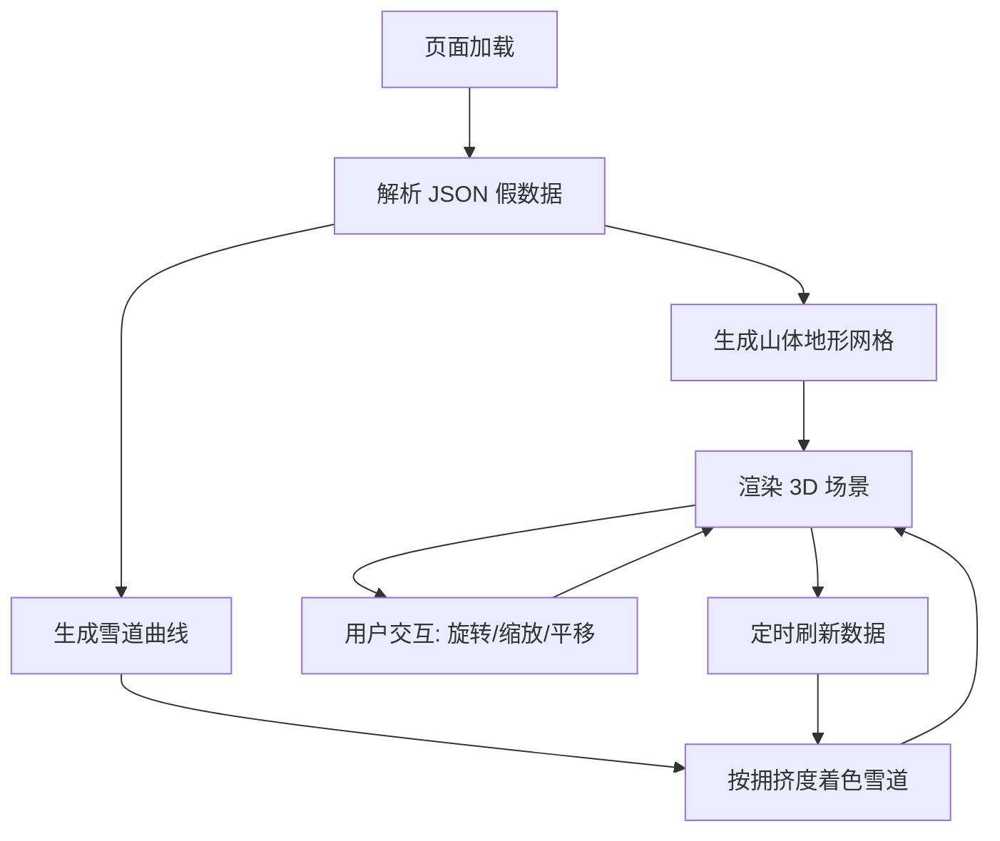

## 1. 产品概述

滑雪场 3D 实时拥挤度可视化系统——基于 Three.js 构建沉浸式 3D 山体与雪道热力图，直观展示各雪道实时拥挤程度，帮助滑雪者选择最佳路线，提升滑雪体验。

- 面向滑雪场运营者和滑雪爱好者，解决雪道拥挤信息不透明的问题
- 以 3D 可视化为核心卖点，打造业内领先的智慧雪场展示方案

## 2. 核心功能

### 2.1 功能模块

1. **3D 山体场景页**: 3D 山体地形渲染、雪道曲线绘制、拥挤度热力着色、Orbit 旋转交互
2. **信息面板**: 雪道拥挤度图例、雪道列表与状态、实时数据刷新

### 2.2 页面详情

| 页面名称 | 模块名称 | 功能描述 |
|----------|----------|----------|
| 3D 山体场景页 | 山体地形 | 程序化生成起伏山体网格，添加雪地材质与光照 |
| 3D 山体场景页 | 雪道路径 | 基于控制点的 Catmull-Rom 曲线绘制多条雪道 |
| 3D 山体场景页 | 热力着色 | 根据拥挤度数据将雪道按绿→黄→红渐变着色 |
| 3D 山体场景页 | Orbit 控制 | 鼠标拖拽旋转、滚轮缩放、右键平移 |
| 信息面板 | 图例 | 绿(通畅)/黄(较拥挤)/红(拥挤) 三级图例 |
| 信息面板 | 雪道列表 | 各雪道名称、拥挤度百分比、状态标签 |
| 信息面板 | 数据刷新 | 模拟实时数据周期性更新 |

## 3. 核心流程

用户打开页面后，3D 场景自动加载山体与雪道模型，雪道按 JSON 假数据中定义的拥挤度着色。用户可通过鼠标拖拽旋转视角、滚轮缩放、右键平移来观察整个雪场。左侧信息面板展示雪道列表和图例。数据周期性刷新模拟实时更新。

## 4. 用户界面设计

### 4.1 设计风格

- 主色调：冰蓝 + 白色（雪地氛围），强调色用拥挤度色阶（绿黄红）
- 按钮风格：圆角半透明玻璃态（glassmorphism），搭配微妙发光
- 字体：标题用 "Orbitron"（科技感），正文用 "Noto Sans SC"（中文友好）
- 布局：3D 场景全屏沉浸，左下角浮窗信息面板
- 图标风格：线性简约图标，搭配微光效果

### 4.2 页面设计概览

| 页面名称 | 模块名称 | UI 元素 |
|----------|----------|---------|
| 3D 山体场景页 | 山体地形 | 白色雪地材质、环境光 + 方向光、雾效 |
| 3D 山体场景页 | 雪道路径 | 管道几何体、拥挤度色阶着色、发光效果 |
| 3D 山体场景页 | 天空背景 | 渐变天空球，冷色调大气散射 |
| 信息面板 | 图例 | 三色圆点 + 文字标签 |
| 信息面板 | 雪道列表 | 卡片式列表，每项显示名称、进度条、状态 |
| 信息面板 | 标题区 | 雪场名称、刷新时间 |

### 4.3 响应式

- 桌面优先设计，3D 场景全屏自适应
- 移动端信息面板可收起/展开，触控支持旋转缩放

### 4.4 3D 场景指引

- 环境：冷色调天空渐变，地平线雾效营造纵深感
- 光照：环境光（冷白）+ 方向光（偏暖模拟日光），搭配柔和阴影
- 相机：透视相机，初始视角俯瞰雪场 45°，OrbitControls 限制极角避免穿地
- 构图：山体居中偏右，左侧留空间放信息面板
- 交互：OrbitControls 旋转/缩放/平移，雪道悬停高亮
- 后处理：可选 Bloom 效果增强拥挤雪道发光
- 性能预算：60fps，山体面数控制在 5000 以内
