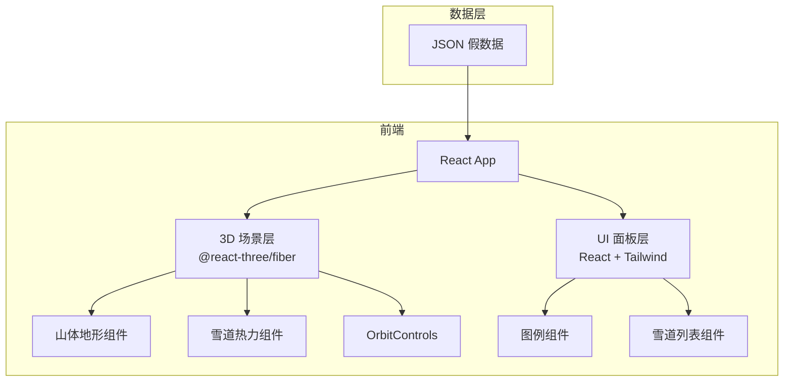

## 1. 架构设计



## 2. 技术说明

- 前端：React@18 + TypeScript + Tailwind CSS@3 + Vite
- 初始化工具：vite-init
- 3D 渲染：Three.js + @react-three/fiber + @react-three/drei + @react-three/postprocessing
- 后端：无
- 数据：本地 JSON 假数据驱动

## 3. 路由定义

| 路由 | 用途 |
|------|------|
| / | 3D 雪场可视化主页 |

## 4. 数据模型

### 4.1 雪道数据结构

```typescript
interface SlopeData {
  id: string;
  name: string;
  difficulty: "beginner" | "intermediate" | "advanced";
  congestion: number; // 0-100
  points: [number, number, number][]; // 雪道控制点坐标
}
```

### 4.2 假数据文件

`src/data/slopes.json` — 包含 8-10 条雪道的假数据，每条雪道包含名称、难度、拥挤度和路径控制点。

## 5. 组件架构

```
src/
├── components/
│   ├── Scene.tsx          # 3D 场景主组件
│   ├── Mountain.tsx       # 山体地形网格
│   ├── SlopePath.tsx      # 单条雪道路径+着色
│   ├── SkyEnvironment.tsx # 天空与雾效
│   └── InfoPanel.tsx      # 左侧信息面板
├── data/
│   └── slopes.json        # 假数据
├── utils/
│   └── congestionColor.ts # 拥挤度→颜色映射
├── App.tsx
└── main.tsx
```

## 6. 关键技术实现

### 6.1 山体地形

- 使用 `PlaneGeometry` 生成平面网格，通过 Perlin 噪声函数扰动顶点 Y 坐标模拟山体起伏
- 白色雪地材质 + 环境遮蔽感

### 6.2 雪道路径

- 每条雪道由 4-6 个控制点定义，使用 `CatmullRomCurve3` 生成平滑曲线
- `TubeGeometry` 沿曲线生成管道几何体，宽度 2-3 单位
- 顶点颜色根据拥挤度映射：绿(0-33) → 黄(34-66) → 红(67-100)

### 6.3 拥挤度颜色映射

- 线性插值：0→绿色(#22c55e)，50→黄色(#eab308)，100→红色(#ef4444)
- 支持渐变过渡，避免色阶跳跃

### 6.4 交互控制

- `OrbitControls`：启用旋转、缩放、平移
- 限制最小/最大距离，限制极角防止穿入地形
- 阻尼效果启用（enableDamping）

### 6.5 数据刷新

- 使用 `setInterval` 每 5 秒随机微调拥挤度数据
- 数据变化时平滑过渡雪道颜色（lerp 动画）
