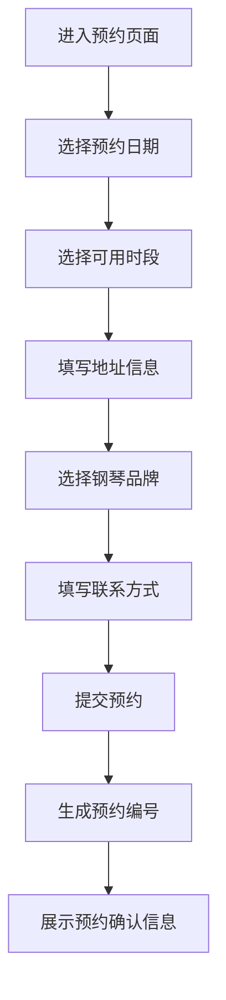

## 1. 产品概述

钢琴调音师上门预约平台，为钢琴拥有者提供便捷的在线预约调音服务。用户可选择日期时段、填写上门地址和钢琴品牌信息、提交联系方式，完成预约后获得唯一预约编号以供查询。

- 解决传统电话预约效率低、时段冲突的问题，实现自助化、可视化的预约流程
- 目标用户：家庭及机构钢琴拥有者，追求专业调音服务的客户群体

## 2. 核心功能

### 2.1 用户角色

| 角色 | 注册方式 | 核心权限 |
|------|----------|----------|
| 预约用户 | 无需注册，直接填写信息 | 选择日期时段、填写预约信息、提交预约 |

### 2.2 功能模块

1. **预约页面**：日历选日期、时段选择、地址与钢琴品牌填写、联系方式填写、提交预约
2. **预约确认页面**：展示预约成功信息及预约编号

### 2.3 页面详情

| 页面名称 | 模块名称 | 功能描述 |
|----------|----------|----------|
| 预约页面 | 日历选择器 | 展示当月日历，可选择预约日期，已过日期和已满日期不可选 |
| 预约页面 | 时段选择 | 根据选中日期展示可选时段（上午 9-12、下午 13-17、傍晚 18-20），已满时段置灰 |
| 预约页面 | 地址表单 | 输入省市区（文本输入）、详细地址 |
| 预约页面 | 钢琴品牌选择 | 下拉选择常见品牌（雅马哈、卡瓦依、施坦威、珠江、星海等）或手动输入 |
| 预约页面 | 联系方式 | 输入姓名、手机号 |
| 预约确认页 | 预约结果 | 展示预约编号、预约日期、时段、地址、钢琴品牌、联系方式摘要 |

## 3. 核心流程

用户打开预约页面 → 浏览日历选择日期 → 选择可用时段 → 填写地址信息 → 选择/输入钢琴品牌 → 填写联系方式 → 点击提交 → 系统生成预约编号 → 展示预约确认信息

## 4. 用户界面设计

### 4.1 设计风格

- 主色调：深靛蓝 (#1B2A4A) + 暖金点缀 (#C8A96E)，传达专业与优雅的钢琴调音气质
- 辅助色：象牙白 (#FAF8F5) 背景、柔和灰色边框
- 按钮风格：圆角按钮，主按钮为深靛蓝底+白字，悬浮时有金色边框发光效果
- 字体：标题使用 Playfair Display 衬线体，正文使用 Noto Sans SC
- 布局风格：居中卡片式布局，单列纵向流程，带有钢琴键盘元素装饰
- 图标风格：线性图标，搭配钢琴/音乐相关的精致装饰元素

### 4.2 页面设计概览

| 页面名称 | 模块名称 | UI 元素 |
|----------|----------|---------|
| 预约页面 | 日历选择器 | 卡片式日历网格，选中日期金色高亮，禁用日期灰色删除线 |
| 预约页面 | 时段选择 | 三个横排胶囊按钮，选中为深靛蓝填充+白字，已满灰色 |
| 预约页面 | 地址表单 | 输入框带浅色下划线，聚焦时下划线变金色 |
| 预约页面 | 钢琴品牌 | 下拉选择器+自定义输入切换 |
| 预约页面 | 联系方式 | 同地址表单风格 |
| 预约确认页 | 预约结果 | 居中大卡片，预约编号金色加粗，信息摘要列表 |

### 4.3 响应式

- 桌面优先设计，最大宽度 640px 居中
- 移动端自适应全宽，日历网格缩小

### 4.4 3D 场景指导

不适用
