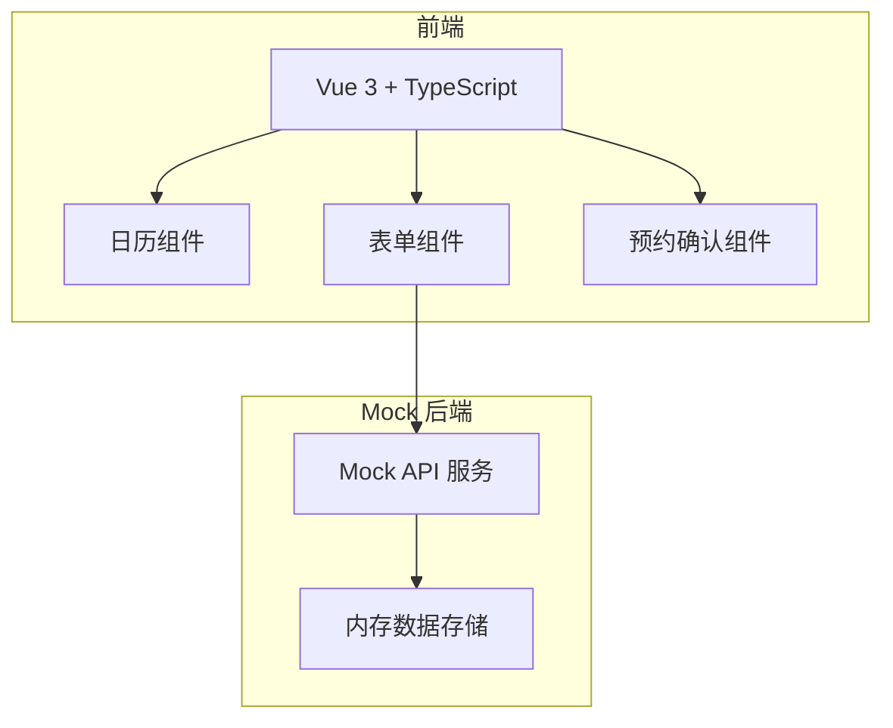
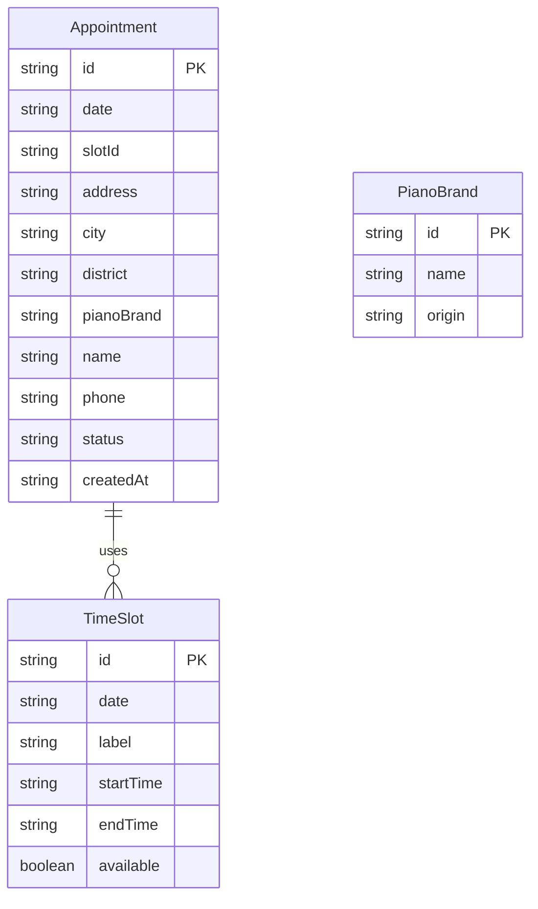

## 1. 架构设计



## 2. 技术说明

- 前端：Vue 3 + TypeScript + Tailwind CSS + Vite
- 初始化工具：vite-init (vue-ts 模板)
- 后端：无（Mock 数据）
- 数据库：无（前端内存存储 + localStorage）

## 3. 路由定义

| 路由 | 用途 |
|------|------|
| / | 预约主页面（日历+表单） |
| /confirmation | 预约确认页面 |

## 4. API 定义（Mock）

### 4.1 获取可用时段

```typescript
interface TimeSlot {
  id: string
  label: string
  startTime: string
  endTime: string
  available: boolean
}

interface AvailableSlotsResponse {
  date: string
  slots: TimeSlot[]
}
```

### 4.2 提交预约

```typescript
interface AppointmentRequest {
  date: string
  slotId: string
  address: string
  city: string
  district: string
  pianoBrand: string
  customBrand?: string
  name: string
  phone: string
}

interface AppointmentResponse {
  success: boolean
  appointmentId: string
  message: string
}
```

### 4.3 钢琴品牌列表

```typescript
interface PianoBrand {
  id: string
  name: string
  origin: string
}
```

## 5. 服务器架构图

不适用（纯前端 + Mock）

## 6. 数据模型

### 6.1 数据模型定义



### 6.2 数据定义语言

不适用（使用前端内存存储和 localStorage）
