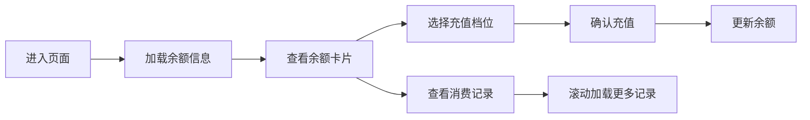

## 1. 产品概述

面包店会员储值卡移动端页面，为会员用户提供便捷的储值卡管理服务，包括余额查询、在线充值和消费记录查看功能。通过充值送券的优惠活动，提升用户粘性和复购率。

### 核心价值
- 为会员提供透明的账户资金管理
- 通过充值档位优惠激励用户预存消费
- 清晰的消费记录增强用户信任感

## 2. 核心功能

### 2.1 用户角色
| 角色 | 核心权限 |
|------|----------|
| 会员用户 | 查看余额、充值、查看消费记录 |

### 2.2 功能模块
1. **余额展示区**：当前余额、会员卡号、卡面设计
2. **充值档位区**：100/200/500 三档充值，各档位送券优惠展示
3. **消费记录区**：交易列表、分页加载、交易类型筛选

### 2.3 页面详情
| 页面名称 | 模块名称 | 功能描述 |
|---------|----------|----------|
| 储值卡首页 | 余额卡片 | 展示当前可用余额、会员卡号、卡面视觉效果 |
| 储值卡首页 | 充值档位 | 三个充值选项，展示金额和赠送优惠券信息，点击选择并确认充值 |
| 储值卡首页 | 消费记录 | 列表展示所有交易记录，包含消费/充值类型、金额、时间、门店 |

## 3. 核心流程

用户进入页面 → 查看当前余额 → 选择充值档位（可选）→ 确认充值 → 余额更新 → 查看消费记录

## 4. 用户界面设计

### 4.1 设计风格
- **主色调**：温暖的焦糖色 `#D4A574`、小麦金 `#F5E6D3`
- **辅助色**：烘焙棕 `#8B6914`、奶油白 `#FFF8F0`
- **强调色**：草莓红 `#E57373`（用于优惠标签）
- **按钮风格**：圆角胶囊按钮，微阴影，悬浮时轻微放大
- **字体**：使用 "Noto Sans SC" 搭配优雅的展示字体
- **布局**：卡片式布局，移动端优先，垂直滚动
- **视觉元素**：小麦纹理背景、圆角卡片、柔和阴影

### 4.2 页面设计概述
| 模块名称 | UI 元素 |
|---------|---------|
| 余额卡片 | 渐变卡面、大号余额数字、会员标签、装饰性烘焙图案 |
| 充值档位 | 三列横向排列、选中态高亮、优惠标签闪烁动画 |
| 消费记录 | 时间线布局、交易类型图标、金额正负颜色区分 |

### 4.3 响应式
- **移动端优先**：375px 基础宽度，自适应至 768px
- **触摸优化**：按钮最小高度 48px，充足点击区域
- **滚动体验**：消费记录区域支持流畅滚动和下拉加载

### 4.4 动效设计
- 页面加载时余额数字滚动动画
- 充值按钮点击反馈（缩放+波纹）
- 消费记录列表项入场动画（渐入+上移）
- 优惠标签脉冲呼吸效果
