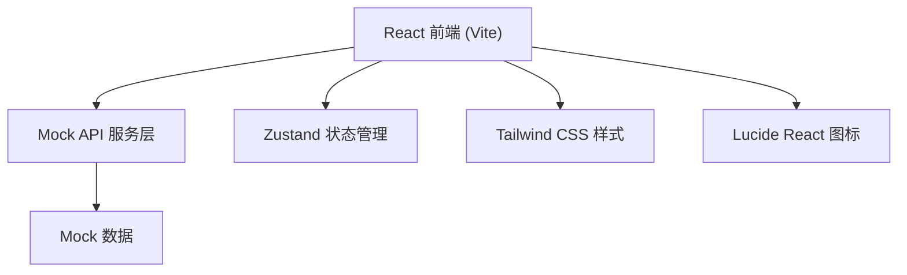
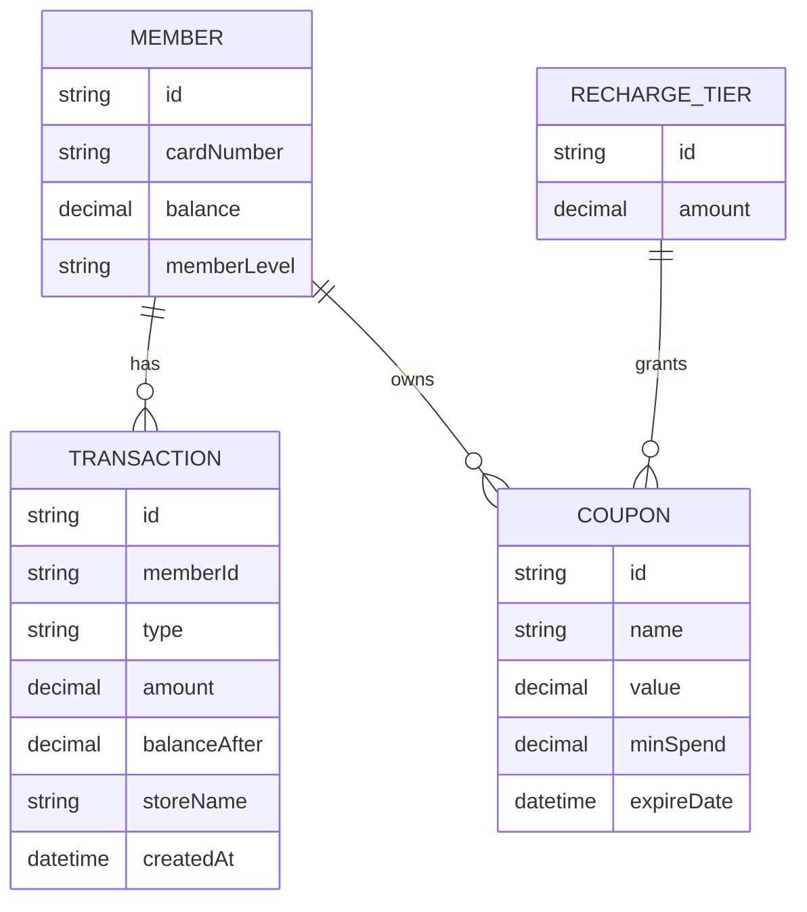

## 1. 架构设计



## 2. 技术描述

- **前端**：React@18 + TypeScript + Vite@5
- **样式**：Tailwind CSS@3
- **状态管理**：Zustand
- **图标库**：Lucide React
- **HTTP 客户端**：原生 fetch（Mock 模式）
- **初始化工具**：vite-init
- **后端**：无（使用 Mock API）

## 3. 路由定义

| 路由 | 页面组件 | 用途 |
|------|---------|------|
| `/` | `MemberCard` | 储值卡首页（余额、充值、消费记录） |

## 4. API 定义（Mock）

### 4.1 类型定义

```typescript
interface MemberInfo {
  id: string;
  cardNumber: string;
  balance: number;
  memberLevel: string;
  memberName: string;
}

interface RechargeTier {
  id: string;
  amount: number;
  bonus: {
    type: 'coupon' | 'cash';
    value: number;
    description: string;
  }[];
}

interface Transaction {
  id: string;
  type: 'recharge' | 'consume';
  amount: number;
  balanceAfter: number;
  description: string;
  storeName: string;
  createdAt: string;
}

interface Coupon {
  id: string;
  name: string;
  value: number;
  minSpend: number;
  expireDate: string;
}
```

### 4.2 Mock API 接口

```typescript
// 获取会员信息
GET /api/member/info
Response: MemberInfo

// 获取充值档位
GET /api/recharge/tiers
Response: RechargeTier[]

// 执行充值
POST /api/recharge
Request: { tierId: string; paymentMethod: string }
Response: { success: boolean; newBalance: number; coupons: Coupon[] }

// 获取消费记录
GET /api/transactions?page=1&pageSize=10
Response: { items: Transaction[]; total: number; hasMore: boolean }
```

## 5. 数据模型

### 5.1 ER 图



### 5.2 Mock 数据

```typescript
const mockMember: MemberInfo = {
  id: 'M001',
  cardNumber: '8888 6666 1234 5678',
  balance: 328.50,
  memberLevel: '黄金会员',
  memberName: '张小姐'
};

const mockTiers: RechargeTier[] = [
  {
    id: 'T100',
    amount: 100,
    bonus: [{ type: 'coupon', value: 10, description: '送10元面包券' }]
  },
  {
    id: 'T200',
    amount: 200,
    bonus: [
      { type: 'coupon', value: 30, description: '送30元蛋糕券' },
      { type: 'cash', value: 10, description: '额外赠10元余额' }
    ]
  },
  {
    id: 'T500',
    amount: 500,
    bonus: [
      { type: 'coupon', value: 100, description: '送100元生日蛋糕券' },
      { type: 'cash', value: 50, description: '额外赠50元余额' }
    ]
  }
];
```

## 6. 项目结构

```
src/
├── components/
│   ├── BalanceCard.tsx      # 余额卡片组件
│   ├── RechargeTiers.tsx    # 充值档位组件
│   ├── TransactionList.tsx  # 消费记录列表
│   └── CouponBadge.tsx      # 优惠券标签组件
├── hooks/
│   └── useMemberStore.ts    # Zustand 状态管理
├── services/
│   └── mockApi.ts           # Mock API 服务
├── types/
│   └── index.ts             # TypeScript 类型定义
├── utils/
│   └── formatters.ts        # 格式化工具函数
├── pages/
│   └── MemberCard.tsx       # 主页面
├── App.tsx
├── main.tsx
└── index.css
```
