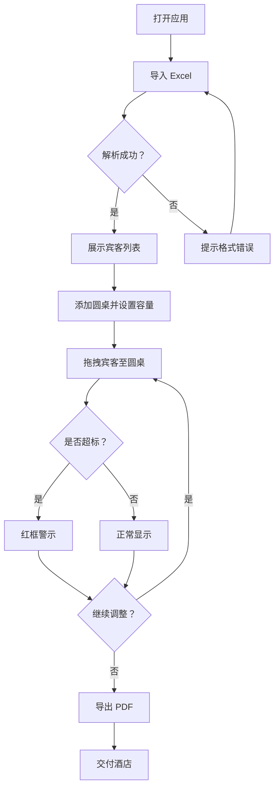

## 1. 产品概述

婚宴排桌助手是一款面向婚礼策划师的 Web 工具，用于高效完成婚宴座位编排。支持导入宾客 Excel 数据，通过拖拽方式将宾客分配到圆桌，实时计算每桌人数并在超标时醒目提示，最终导出 PDF 排桌方案交付酒店。

- 核心痛点：传统手工排桌易出错、耗时长、调整不便，导出格式不统一
- 目标用户：婚礼策划师、婚庆公司工作人员
- 产品价值：将排桌时间从数小时缩短至数十分钟，减少排座错误，输出标准化排桌方案

## 2. 核心功能

### 2.1 功能模块

1. **排桌工作台**：宾客列表、圆桌画布、操作工具栏
2. **Excel 导入**：上传 Excel 文件，自动解析宾客姓名、人数、关系
3. **拖拽排座**：将宾客从列表拖拽至圆桌，支持桌间拖移
4. **实时计数**：每桌自动统计人数，超标红框警示
5. **PDF 导出**：一键生成排桌方案 PDF，含桌号、宾客、人数汇总

### 2.2 页面详情

| 页面名称 | 模块名称 | 功能描述 |
|----------|----------|----------|
| 排桌工作台 | 宾客列表面板 | 展示导入的宾客列表，按关系分组，支持搜索过滤，可拖拽到圆桌 |
| 排桌工作台 | 圆桌画布 | 可视化展示多张圆桌，支持增删桌、设置每桌容量上限，拖拽放入宾客 |
| 排桌工作台 | 工具栏 | 导入 Excel、添加圆桌、设置容量、导出 PDF、清空重排 |
| 排桌工作台 | 统计面板 | 总宾客数、已排/未排人数、每桌人数条形图 |

## 3. 核心流程

用户打开应用 → 导入 Excel 宾客数据 → 系统解析并展示宾客列表 → 用户添加圆桌（可设每桌容量）→ 拖拽宾客至圆桌 → 系统实时计算每桌人数 → 超标桌红框警示 → 调整完毕后导出 PDF

## 4. 用户界面设计

### 4.1 设计风格

- **主色调**：香槟金 (#C9A96E) + 深棕 (#3D2B1F)，辅以象牙白 (#FFF8F0) 背景
- **强调色**：玫瑰粉 (#E8A0BF) 用于警示与点缀
- **按钮风格**：圆角胶囊型，香槟金底色配白色文字，hover 加深
- **字体**：标题使用 Playfair Display 衬线体，正文使用 Noto Sans SC
- **布局风格**：三栏布局——左侧宾客列表面板、中间圆桌画布、右侧统计面板
- **图标**：Lucide 图标库，线性风格
- **圆桌视觉**：圆形卡片模拟圆桌，中心显示桌号，环绕显示宾客姓名标签

### 4.2 页面设计概述

| 页面名称 | 模块名称 | UI 元素 |
|----------|----------|---------|
| 排桌工作台 | 宾客列表面板 | 白色卡片、搜索输入框、关系分组折叠面板、可拖拽宾客标签 |
| 排桌工作台 | 圆桌画布 | 圆形桌卡片（香槟金边框）、中心桌号、环绕宾客标签、超标红框动画 |
| 排桌工作台 | 工具栏 | 顶部固定栏、胶囊按钮组、文件上传区域 |
| 排桌工作台 | 统计面板 | 数据卡片、迷你条形图、进度条 |

### 4.3 响应式

- 桌面优先设计，最小支持 1280px 宽度
- 三栏固定布局，侧面板可折叠
- 不做移动端适配

### 4.4 动效

- 宾客标签拖拽时半透明 + 放大 1.05
- 放入圆桌时缩放弹跳动画
- 超标红框脉冲闪烁
- 页面加载渐显入场
