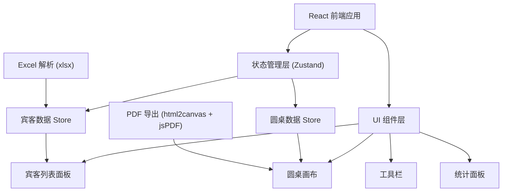
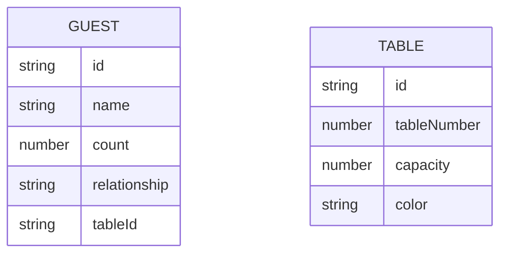

## 1. 架构设计



## 2. 技术描述

- **前端框架**: React@18 + TypeScript
- **构建工具**: Vite@5
- **样式方案**: TailwindCSS@3
- **状态管理**: Zustand@4
- **拖拽交互**: @dnd-kit/core + @dnd-kit/sortable
- **Excel 解析**: xlsx@0.18
- **PDF 导出**: html2canvas + jspdf
- **图标库**: lucide-react
- **字体**: Google Fonts (Playfair Display, Noto Sans SC)

## 3. 路由定义

| 路由 | 目的 |
|------|------|
| / | 排桌工作台（单页应用） |

## 4. 数据模型

### 4.1 数据模型定义



### 4.2 TypeScript 类型定义

```typescript
interface Guest {
  id: string;
  name: string;
  count: number;
  relationship: string;
  tableId: string | null;
}

interface Table {
  id: string;
  tableNumber: number;
  capacity: number;
  color: string;
}

interface AppState {
  guests: Guest[];
  tables: Table[];
  addGuest: (guest: Omit<Guest, 'id' | 'tableId'>) => void;
  addTable: (capacity: number) => void;
  assignGuestToTable: (guestId: string, tableId: string | null) => void;
  removeTable: (tableId: string) => void;
  clearAll: () => void;
  importGuests: (guests: Omit<Guest, 'id' | 'tableId'>[]) => void;
}
```

## 5. 核心组件结构

```
src/
├── components/
│   ├── GuestList/
│   │   ├── GuestList.tsx
│   │   └── GuestItem.tsx
│   ├── TableCanvas/
│   │   ├── TableCanvas.tsx
│   │   ├── RoundTable.tsx
│   │   └── TableGuest.tsx
│   ├── Toolbar/
│   │   ├── Toolbar.tsx
│   │   ├── ExcelImport.tsx
│   │   └── PDFExport.tsx
│   ├── StatsPanel/
│   │   └── StatsPanel.tsx
│   └── common/
│       └── Modal.tsx
├── store/
│   └── useAppStore.ts
├── types/
│   └── index.ts
├── utils/
│   ├── excelParser.ts
│   └── pdfExport.ts
├── App.tsx
├── main.tsx
└── index.css
```
