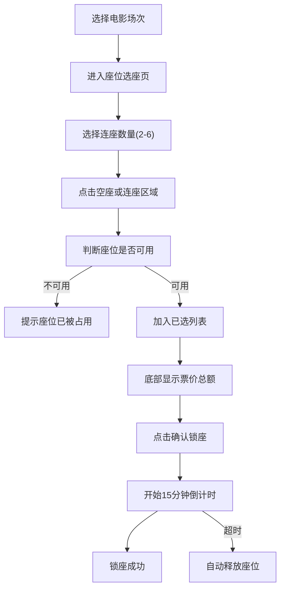

## 1. 产品概述

电影院在线选座购票系统，用户可选择电影场次后查看座位图，点选空座进行锁座（锁座有效期15分钟），支持2-6张连座选择，底部实时显示票价总额，最终确认锁座完成购票流程。

---

## 2. 核心功能

### 2.1 用户角色
| 角色 | 注册方式 | 核心权限 |
|------|----------|----------|
| 普通用户 | 无需注册（游客模式） | 浏览场次、选择座位、锁座购票 |

### 2.2 功能模块
1. **场次选择页**：电影信息、日期场次列表、选择场次
2. **座位选座页**：座位图展示、座位选择、连座推荐、锁座倒计时
3. **订单确认栏**：票价计算、已选座位信息、确认锁座按钮

### 2.3 页面详情
| 页面名称 | 模块名称 | 功能描述 |
|-----------|-------------|---------------------|
| 场次选择页 | 电影信息卡片 | 展示电影海报、片名、时长、类型 |
| 场次选择页 | 日期场次列表 | 按日期分组展示可购票场次，点击进入选座 |
| 座位选座页 | 座位图Canvas | 绘制座位布局，区分空座/已售/已选/锁座状态 |
| 座位选座页 | 连座选择器 | 选择2-6张连座数量，自动高亮推荐区域 |
| 座位选座页 | 座位图例 | 说明不同颜色代表的座位状态 |
| 座位选座页 | 锁座倒计时 | 选择座位后显示15分钟倒计时，超时释放 |
| 订单确认栏 | 票价展示 | 显示单价、数量、总价 |
| 订单确认栏 | 确认锁座 | 点击后锁定座位，模拟下单成功 |

---

## 3. 核心流程

用户浏览电影场次 → 选择具体场次 → 进入座位图 → 选择座位数量（2-6张）→ 点击座位或使用连座推荐 → 查看价格 → 确认锁座 → 锁定成功（15分钟内有效）

---

## 4. 用户界面设计

### 4.1 设计风格
- **主色调**：深红 (#E50914) - 代表电影、热情、活力
- **辅助色**：金黄 (#FFD700) - 突出选中、推荐区域
- **背景色**：深灰蓝 (#1A1A2E) - 营造电影院沉浸式氛围
- **座位状态色**：空座(#3D3D5C)、已选(#FFD700)、已售(#0F0F1A)、锁座(#E50914)
- **字体**：
  - 标题：Noto Serif SC - 经典电影海报质感
  - 正文：Noto Sans SC - 清晰易读
- **按钮风格**：圆角16px，悬停有微缩放和发光效果
- **布局风格**：卡片式布局，毛玻璃效果，深色主题
- **图标风格**：lucide-react线性图标，与整体风格统一

### 4.2 页面设计概述
| 页面名称 | 模块名称 | UI元素 |
|-----------|-------------|-------------|
| 场次选择页 | 电影信息卡片 | 海报左对齐，片名大字号，右侧渐变遮罩 |
| 场次选择页 | 日期选择条 | 横向滚动，选中日期有底部红条指示 |
| 场次选择页 | 场次卡片 | 网格布局，显示时间、语言、价格，悬停浮起 |
| 座位选座页 | 座位图Canvas | 居中显示，屏幕在上方，座位行列标注，点击有涟漪动画 |
| 座位选座页 | 连座数量选择 | 横向按钮组，2-6数字，选中高亮金黄色 |
| 座位选座页 | 座位图例 | 底部横向排列，圆形色块+文字说明 |
| 订单确认栏 | 固定底部栏 | 毛玻璃背景，左侧票价信息，右侧确认按钮 |
| 订单确认栏 | 倒计时 | 选中座位后顶部显示红色倒计时条 |

### 4.3 响应性
- 桌面端优先设计，座位图保持固定比例
- 移动端适配：场次卡片改为单列，座位图缩小显示，底部操作栏优化触控区域
- 座位点击区域不小于44x44px，确保移动端操作流畅

### 4.4 动效设计
- 页面切换：淡入+向上滑动过渡
- 座位选中：金黄渐变填充+轻微弹跳动画
- 连座推荐：呼吸灯效果高亮可选区域
- 锁座成功：金色粒子扩散动画
- 倒计时：最后1分钟数字闪烁红色
