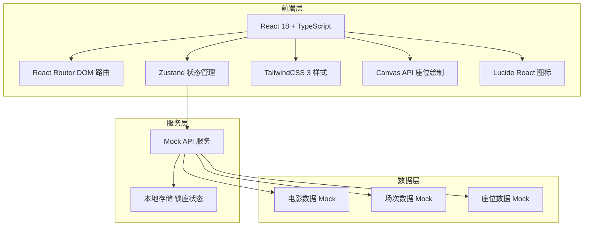
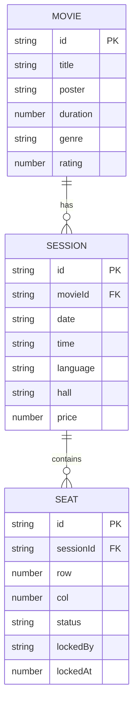

## 1. 架构设计



---

## 2. 技术描述

- **前端框架**：React@18 + TypeScript@5 + Vite@5
- **路由管理**：react-router-dom@6
- **状态管理**：zustand@4
- **样式方案**：tailwindcss@3
- **图标库**：lucide-react
- **座位绘制**：原生 Canvas 2D API
- **后端模拟**：前端 Mock API + localStorage 持久化
- **初始化工具**：vite-init react-ts 模板

---

## 3. 路由定义

| Route | 页面 | 用途 |
|-------|------|------|
| `/` | 场次选择页 | 展示电影信息和可购票场次列表 |
| `/seats/:sessionId` | 座位选座页 | 展示座位图、选座、锁座操作 |

---

## 4. API 定义（Mock）

### 4.1 类型定义

```typescript
// 电影信息
interface Movie {
  id: string;
  title: string;
  poster: string;
  duration: number;
  genre: string;
  description: string;
  rating: number;
}

// 场次信息
interface Session {
  id: string;
  movieId: string;
  date: string;
  time: string;
  language: string;
  hall: string;
  price: number;
}

// 座位状态
type SeatStatus = 'available' | 'sold' | 'selected' | 'locked';

// 座位信息
interface Seat {
  id: string;
  row: number;
  col: number;
  status: SeatStatus;
  lockedBy?: string;
  lockedAt?: number;
}

// 座位布局
interface SeatLayout {
  sessionId: string;
  rows: number;
  cols: number;
  seats: Seat[];
}

// 锁座请求
interface LockSeatsRequest {
  sessionId: string;
  seatIds: string[];
}

// 锁座响应
interface LockSeatsResponse {
  success: boolean;
  orderId?: string;
  expireAt?: number;
  message?: string;
}
```

### 4.2 Mock 接口

| 接口 | 方法 | 描述 |
|------|------|------|
| `/api/movies` | GET | 获取电影列表 |
| `/api/movies/:movieId/sessions` | GET | 获取电影的场次列表 |
| `/api/sessions/:sessionId/seats` | GET | 获取场次座位布局 |
| `/api/seats/lock` | POST | 锁座请求 |
| `/api/seats/unlock` | POST | 释放座位 |

---

## 5. 数据模型

### 5.1 ER 图



### 5.2 Mock 数据说明

- **电影数据**：2-3部热门电影，包含海报、片名、时长、评分
- **场次数据**：每部电影每天3-5个场次，覆盖不同时段
- **座位数据**：10排 × 14座 = 140个座位，随机分布20-30%已售座位
- **锁座逻辑**：使用 localStorage 存储锁座状态，15分钟后自动过期

---

## 6. 项目结构

```
src/
├── components/
│   ├── MovieCard.tsx          # 电影信息卡片
│   ├── SessionList.tsx        # 场次列表
│   ├── SeatCanvas.tsx         # Canvas座位图核心组件
│   ├── SeatLegend.tsx         # 座位图例
│   ├── TicketCountSelector.tsx # 连座数量选择器
│   ├── OrderBar.tsx           # 底部订单确认栏
│   └── CountdownTimer.tsx     # 锁座倒计时
├── pages/
│   ├── SessionPage.tsx        # 场次选择页
│   └── SeatPage.tsx           # 座位选座页
├── store/
│   └── useSeatStore.ts        # 座位状态管理
├── api/
│   └── mockApi.ts             # Mock API 接口
├── types/
│   └── index.ts               # 类型定义
├── utils/
│   └── seatUtils.ts           # 座位工具函数（连座算法等）
├── mock/
│   └── data.ts                # Mock 数据
├── App.tsx
├── main.tsx
└── index.css
```
