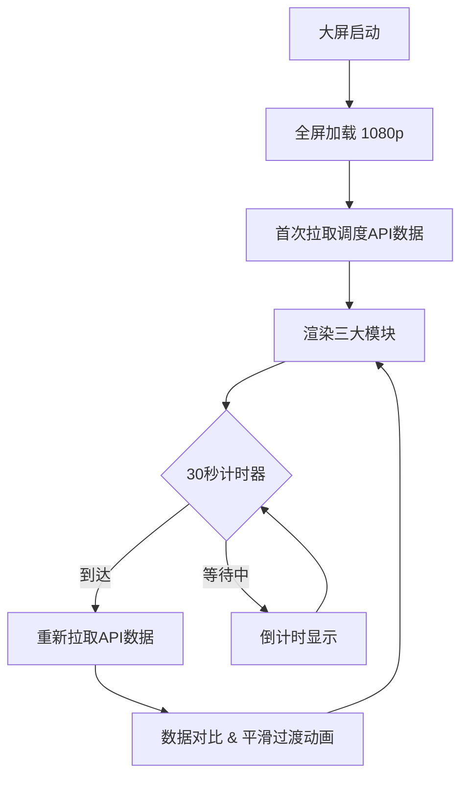

## 1. 产品概述

公交集团到站预测大屏，面向调度控制室运营人员，实时展示各线路下一班预计到站时间、整体准点率仪表盘及晚点排行，辅助快速识别延误线路并做出调度决策。

- 解决核心问题：调度员需一目了然掌握全网运行状态，传统表格信息密度低、定位慢
- 目标价值：缩短延误发现时间，提升公交运营准点率与调度效率

## 2. 核心功能

### 2.1 用户角色

| 角色 | 接入方式 | 核心权限 |
|------|----------|----------|
| 调度员 | 控制室大屏直接访问 | 查看全量线路实时数据 |
| 运营主管 | 同上 | 查看全量数据 + 关注晚点Top5 |

### 2.2 功能模块

1. **大屏主页**：线路到站预测表、准点率仪表盘、晚点Top5柱状图、系统时间与刷新状态

### 2.3 页面详情

| 页面名称 | 模块名称 | 功能描述 |
|----------|----------|----------|
| 大屏主页 | 线路到站预测表 | 展示所有监控线路的下一班预计到站时间、距当前分钟数、状态标签（准时/晚点/即将到站） |
| 大屏主页 | 准点率仪表盘 | 以环形/半圆仪表盘展示全网整体准点率百分比，指针动画过渡 |
| 大屏主页 | 晚点Top5柱状图 | 按晚点时长降序排列前5条线路，水平柱状图，颜色梯度表示严重程度 |
| 大屏主页 | 顶部状态栏 | 系统时间、数据刷新倒计时、网络状态指示灯 |
| 大屏主页 | 线路状态统计 | 在线线路数、晚点线路数、停运线路数三类统计卡片 |

## 3. 核心流程

调度员进入控制室，大屏自动全屏加载。系统每30秒从调度API拉取最新数据，界面平滑过渡更新。调度员重点关注：准点率仪表盘是否低于阈值、晚点Top5中哪些线路需干预、到站预测表中的异常延迟线路。

## 4. 用户界面设计

### 4.1 设计风格

- 主色调：深色背景 `#0a0e27`（深蓝黑），辅以 `#111633` 卡片底色
- 强调色：`#00e5ff`（电光青）用于准时/正常状态，`#ff3d71`（警示红）用于晚点/异常，`#ffaa00`（琥珀黄）用于即将到站/临界
- 按钮风格：无按钮交互，纯展示大屏
- 字体：标题用 "Orbitron" 科技感等宽字体，数据用 "Source Sans 3" 清晰易读
- 布局：经典大屏三栏布局，左侧到站预测表，右上准点率仪表盘 + 统计卡片，右下晚点Top5
- 图标风格：线性图标，2px 描边，与科技风一致
- 背景细节：微弱网格线纹理、底部发光边线、卡片微弱辉光

### 4.2 页面设计总览

| 页面名称 | 模块名称 | UI 元素 |
|----------|----------|---------|
| 大屏主页 | 顶部状态栏 | 深色底，左侧标题+Logo，右侧系统时间+倒计时+状态灯 |
| 大屏主页 | 线路到站预测表 | 左侧60%宽，表格行交替深色，状态标签带色彩圆点，行入场动画 |
| 大屏主页 | 准点率仪表盘 | 右上30%区域，SVG半圆仪表盘，指针带缓动动画，中心大号百分比数字 |
| 大屏主页 | 统计卡片 | 仪表盘下方三个小卡片：在线/晚点/停运线路数 |
| 大屏主页 | 晚点Top5柱状图 | 右下区域，水平柱状图，柱体渐变色（黄→红），标签在柱体末端 |

### 4.3 响应式

- 桌面优先，固定 1920×1080 分辨率
- 不做移动端适配（控制室专用大屏）
- 字体使用 px 固定尺寸确保远距离可读

### 4.4 动效设计

- 页面加载：模块依次淡入 + 轻微上移，stagger 延迟 0.1s
- 数据刷新：数值变化时数字滚动过渡（countUp 效果）
- 仪表盘指针：CSS transition 1s ease-out
- 柱状图柱体：宽度变化 0.8s ease 动画
- 状态标签：晚点标签脉冲红色微光动画
