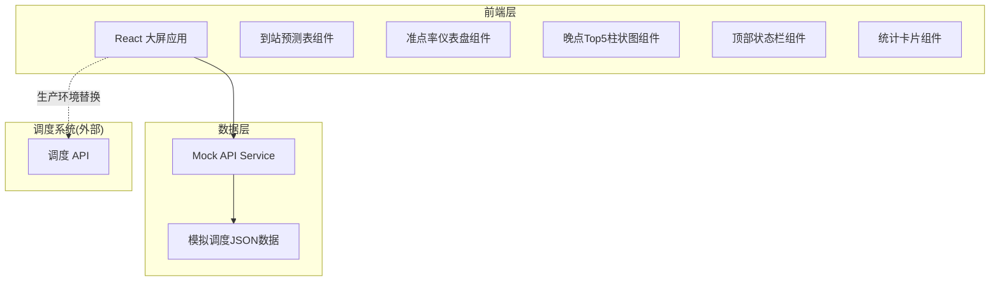
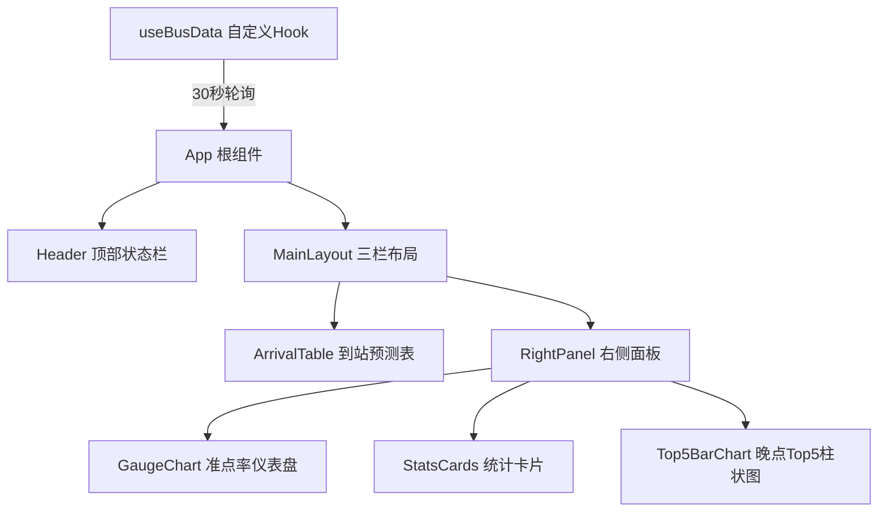
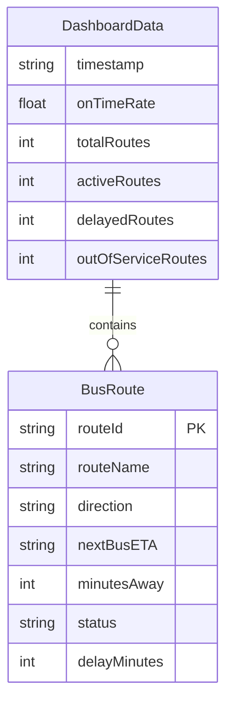

## 1. 架构设计



## 2. 技术说明

- 前端：React@18 + Tailwind CSS@3 + Vite
- 初始化工具：Vite (react-ts 模板)
- 后端：无后端，前端直接消费 API JSON
- 数据库：无数据库，使用 Mock 数据模拟调度API响应
- 图表：纯 SVG 手绘（仪表盘）+ CSS 实现（柱状图），无需第三方图表库
- 动画：CSS transitions + requestAnimationFrame 数字滚动

## 3. 路由定义

| 路由 | 用途 |
|------|------|
| / | 大屏主页，全屏展示所有模块 |

单页应用，仅一个路由，全屏展示。

## 4. API 定义

### 4.1 调度数据接口

```typescript
interface BusRoute {
  routeId: string;
  routeName: string;
  direction: string;
  nextBusETA: string;        // ISO 8601 格式，如 "2026-06-02T14:32:00"
  minutesAway: number;       // 距到站分钟数
  status: "on-time" | "delayed" | "arriving" | "out-of-service";
  delayMinutes: number;     // 晚点分钟数，0表示准时
}

interface DashboardData {
  timestamp: string;          // 数据时间戳
  onTimeRate: number;         // 准点率 0-100
  totalRoutes: number;
  activeRoutes: number;
  delayedRoutes: number;
  outOfServiceRoutes: number;
  routes: BusRoute[];
  top5Delayed: BusRoute[];   // 已按 delayMinutes 降序
}
```

### 4.2 Mock 数据策略

前端内置 Mock 数据生成器，随机产生 12-16 条线路数据：
- 准点率随机 72%-96%
- 1-3 条线路即将到站（minutesAway <= 2）
- 2-5 条线路晚点（delayMinutes 3-15 分钟）
- 1-2 条线路停运

每 30 秒重新生成模拟数据，模拟真实刷新。

## 5. 组件架构图



## 6. 数据模型

### 6.1 数据模型定义



### 6.2 数据定义

纯前端项目，无数据库DDL。Mock 数据在 `src/mock/data.ts` 中生成。
