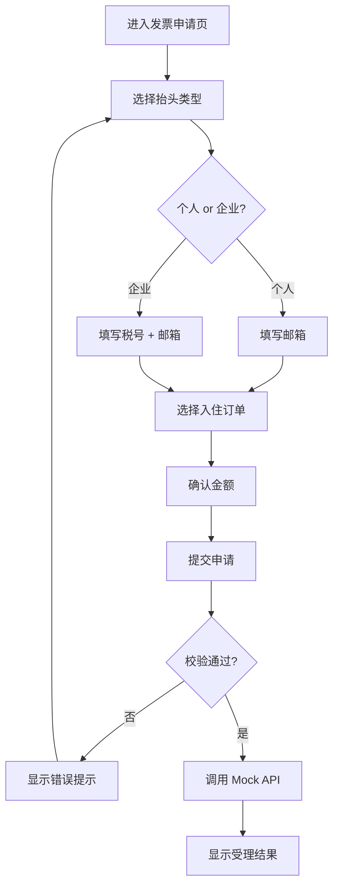

## 1. 产品概述

民宿电子发票申请系统——为离店客人提供便捷的电子发票在线申请服务，客人填写发票信息并选择入住订单后提交，系统即时反馈受理状态与预计开具时间。

- 解决离店后纸质发票申请不便、人工流程繁琐的痛点
- 目标用户：民宿离店客人，操作简单、表单清晰

## 2. 核心功能

### 2.1 用户角色

| 角色 | 注册方式 | 核心权限 |
|------|----------|----------|
| 离店客人 | 无需注册 | 填写发票信息、选择订单、提交申请 |

### 2.2 功能模块

1. **发票申请页**：发票抬头信息表单、订单选择、金额确认、提交申请
2. **申请结果页**：受理状态展示、预计开具时间

### 2.3 页面详情

| 页面名称 | 模块名称 | 功能描述 |
|----------|----------|----------|
| 发票申请页 | 抬头类型选择 | 切换「个人」/「企业」，企业时需填写税号 |
| 发票申请页 | 税号输入 | 选择企业时必填，18位统一社会信用代码校验 |
| 发票申请页 | 邮箱输入 | 必填，接收电子发票的邮箱，格式校验 |
| 发票申请页 | 订单选择 | 从入住订单列表中选择，显示房间号、入住/离店日期、金额 |
| 发票申请页 | 金额确认 | 显示所选订单金额，只读 |
| 发票申请页 | 提交按钮 | 表单校验通过后提交，调用 Mock API |
| 申请结果页 | 受理状态 | 显示「申请已受理」成功提示 |
| 申请结果页 | 预计时间 | 显示预计 1-3 个工作日内开具并推送至邮箱 |

## 3. 核心流程

用户进入发票申请页 → 选择抬头类型（个人/企业）→ 填写发票信息（税号、邮箱）→ 选择入住订单 → 确认金额 → 点击提交 → 表单校验 → 调用 Mock 发票 API → 显示受理结果

## 4. 用户界面设计

### 4.1 设计风格

- **主色调**：暖棕色 (#8B6F47) 为主色，搭配米白 (#FAF7F2) 背景和深棕 (#3D2B1F) 文字，营造民宿温馨自然氛围
- **辅助色**：淡金色 (#D4A574) 作为强调色
- **按钮风格**：圆角（rounded-lg），主按钮暖棕底色白字，hover 加深
- **字体**：标题使用 Noto Serif SC 衬线体营造雅致感，正文使用系统无衬线字体
- **布局风格**：居中卡片式布局，顶部带民宿品牌装饰
- **图标风格**：线性图标（lucide-vue-next），搭配微动画

### 4.2 页面设计概览

| 页面名称 | 模块名称 | UI 元素 |
|----------|----------|---------|
| 发票申请页 | 页面头部 | 暖棕背景，白色标题文字，小屋图标装饰 |
| 发票申请页 | 抬头类型选择 | 两个卡片式单选按钮，选中高亮边框 + 图标 |
| 发票申请页 | 表单区域 | 带图标的输入框，浮动标签，校验错误红色提示 |
| 发票申请页 | 订单选择 | 卡片列表，选中高亮，显示房间/日期/金额 |
| 发票申请页 | 金额确认 | 只读大字号展示 |
| 发票申请页 | 提交按钮 | 全宽暖棕按钮，hover 渐变，disabled 灰色 |
| 申请结果页 | 成功图标 | 大号绿色勾选图标，缩放入场动画 |
| 申请结果页 | 状态文字 | 深棕标题「申请已受理」，副标题预计时间 |
| 申请结果页 | 返回按钮 | 描边样式，返回申请页 |

### 4.3 响应式

- Desktop-first 设计，最大宽度 640px 居中
- 移动端自适应，表单元素全宽
- 触控优化：按钮最小高度 44px，输入框最小高度 44px

### 4.4 iOS 微信端专项适配

#### 4.4.1 键盘顶飞输入框问题修复

- **问题描述**：iOS 微信内选择企业抬头后，弹出键盘会顶飞税号输入框，导致不可见
- **解决方案**：
  1. 使用 `scrollIntoView({ behavior: 'smooth', block: 'center' })` 在输入框聚焦时自动滚动到可视区域
  2. 监听 `focus` 事件，延迟 300ms 后执行滚动（等待键盘弹出）
  3. 税号、邮箱输入框均需配置聚焦自动滚动
  4. 使用 CSS `scroll-padding-bottom` 预留键盘空间

#### 4.4.2 fixed 底部按钮遮挡问题修复

- **问题描述**：提交按钮使用 `position: fixed` 固定在底部时，被 iOS 底部安全区域（Home Indicator）或微信导航栏遮挡
- **解决方案**：
  1. 不使用 `position: fixed`，改为页面流式布局，提交按钮位于表单底部
  2. 使用 `padding-bottom: calc(env(safe-area-inset-bottom) + 1rem)` 处理 iOS 底部安全区域
  3. 外层容器设置 `min-height: 100vh` + `padding-bottom` 确保按钮可见
  4. `viewport` meta 标签设置 `viewport-fit=cover` 支持安全区域

#### 4.4.3 其他 iOS 适配

- 禁用 `-webkit-tap-highlight-color` 去除点击高亮
- 使用 `-webkit-appearance: none` 去除输入框默认样式
- 移除 `input` 的自动大写、自动纠错（`autocapitalize="off"` `autocorrect="off"`）
- 税号输入框设置 `inputmode="text"` 避免数字键盘

### 4.5 3D 场景

不适用
