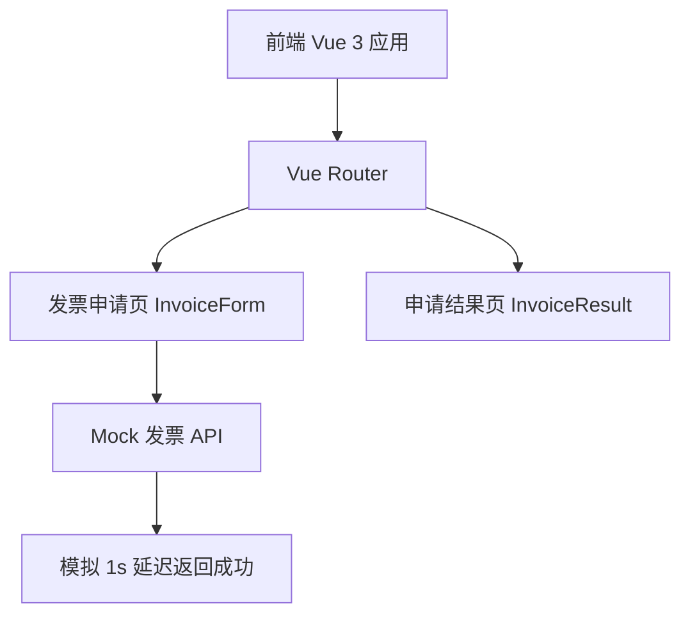

## 1. 架构设计



纯前端应用，使用 Mock API 模拟后端接口。

## 2. 技术说明

- **前端**：Vue 3 + TypeScript + Tailwind CSS + Vite + VeeValidate
- **初始化工具**：vite-init (vue-ts 模板)
- **后端**：无（使用 Mock API）
- **数据库**：无（使用内存 Mock 数据）
- **表单校验**：VeeValidate + yup
- **图标**：lucide-vue-next

## 2.1 iOS 微信端适配技术方案

### 2.1.1 核心 Composable

`src/composables/useInputScroll.ts` - 处理输入框聚焦滚动

```typescript
export function useInputScroll() {
  const scrollIntoView = (el: HTMLElement, delay = 300) => {
    setTimeout(() => {
      el.scrollIntoView({ behavior: 'smooth', block: 'center' })
    }, delay)
  }
  return { scrollIntoView }
}
```

### 2.1.2 全局样式配置

```css
/* tailwind.config.js 扩展安全区域 */
@tailwind base;
@tailwind components;
@tailwind utilities;

html {
  scroll-padding-bottom: 300px; /* 预留键盘空间 */
}

input {
  -webkit-tap-highlight-color: transparent;
  -webkit-appearance: none;
}

.safe-bottom {
  padding-bottom: calc(env(safe-area-inset-bottom) + 1rem);
}
```

### 2.1.3 viewport 配置

```html
<meta name="viewport" content="width=device-width, initial-scale=1.0, maximum-scale=1.0, user-scalable=no, viewport-fit=cover">
```

## 3. 路由定义

| 路由 | 用途 |
|------|------|
| / | 发票申请页，含表单和订单选择 |
| /result | 申请结果页，显示受理状态 |

## 4. API 定义

### 4.1 提交发票申请

```typescript
interface InvoiceRequest {
  titleType: 'personal' | 'enterprise'
  taxId?: string
  email: string
  orderId: string
  amount: number
}

interface InvoiceResponse {
  success: boolean
  message: string
  estimatedDays: string
  applicationNo: string
}
```

**POST /api/invoice/apply**

- 请求体：`InvoiceRequest`
- 响应体：`InvoiceResponse`
- Mock 实现：1 秒延迟后返回成功

### 4.2 获取订单列表

```typescript
interface OrderItem {
  id: string
  roomNo: string
  checkIn: string
  checkOut: string
  amount: number
  guestName: string
}
```

**GET /api/orders**

- 响应体：`OrderItem[]`
- Mock 实现：返回 3-4 条预设订单

## 5. 服务器架构

不适用（纯前端 + Mock API）

## 6. 数据模型

不适用（使用 Mock 数据，无持久化）
