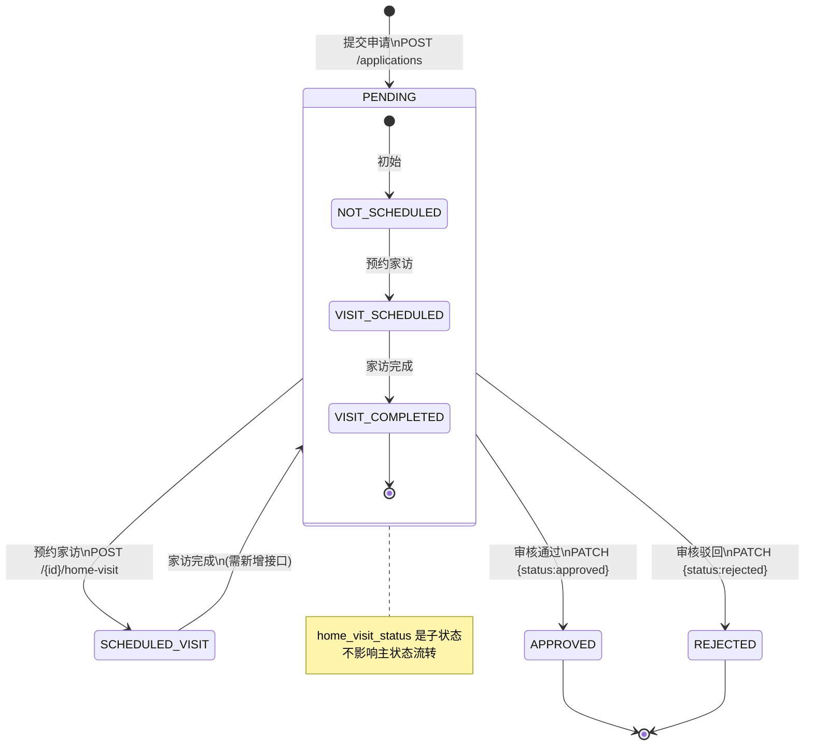
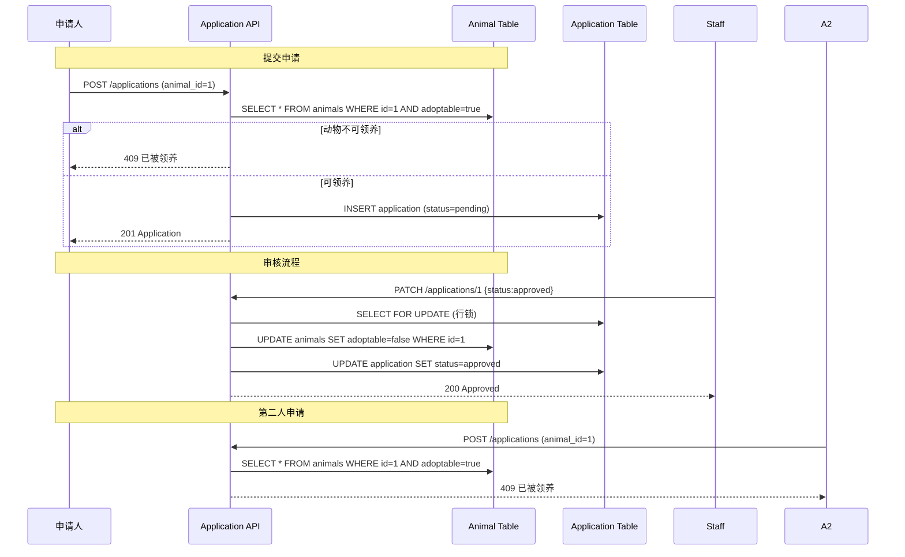

# 领养申请状态机与动物状态联动设计

## 一、领养申请状态机



### 状态字段说明

**主状态** `status` ([models.py#L44-L46](file:///Users/lxy/Documents/wkspsTreacn/test-DF/packages/0601/batch158/app/models.py#L44-L46))：
- `pending` — 待审核（可预约家访、可传照片、可审核）
- `approved` — 已通过（锁定动物、发邮件）
- `rejected` — 已驳回（发邮件）

**子状态** `home_visit_status` ([models.py#L48-L50](file:///Users/lxy/Documents/wkspsTreacn/test-DF/packages/0601/batch158/app/models.py#L48-L50))：
- `not_scheduled` — 未预约
- `scheduled` — 已预约
- `completed` — 已完成

---

## 二、动物状态联动



### 联动规则

| 动作 | 应用状态变化 | 动物状态变化 |
|------|-------------|-------------|
| 提交申请 | `pending` | 无（校验 `adoptable=true`） |
| 审核通过 | `approved` | `adoptable=false` |
| 审核驳回 | `rejected` | 无（保持 `adoptable=true`） |

**关键代码位置**：
- 提交校验：[main.py#L74-L75](file:///Users/lxy/Documents/wkspsTreacn/test-DF/packages/0601/batch158/app/main.py#L74-L75)
- 审核联动：[main.py#L199-L202](file:///Users/lxy/Documents/wkspsTreacn/test-DF/packages/0601/batch158/app/main.py#L199-L202)

---

## 三、家访模块如何插入现有 PATCH 审核流程

### 当前流程

```mermaid
flowchart LR
    A[PATCH /{id}\nstatus=approved/rejected] --> B{status == pending?}
    B -->|No| C[400 已审核]
    B -->|Yes| D[更新 status / reviewer_note]
    D --> E{status == approved?}
    E -->|Yes| F[animal.adoptable=false]
    E -->|No| G[跳过]
    F --> H[发邮件]
    G --> H
    H --> I[返回]
```

### 方案一：**业务校验（推荐）**

在 PATCH 审核前增加"必须完成家访"校验：

```mermaid
flowchart LR
    A[PATCH /{id}\nstatus=approved/rejected] --> B{status == pending?}
    B -->|No| C[400 已审核]
    B -->|Yes| D{home_visit_status\n== completed?}
    D -->|No| E[400 请先完成家访]
    D -->|Yes| F[更新 status / reviewer_note]
    F --> G{status == approved?}
    G -->|Yes| H[animal.adoptable=false]
    G -->|No| I[跳过]
    H --> J[发邮件]
    I --> J
    J --> K[返回]
```

**代码改动点**（[main.py#L189-L191](file:///Users/lxy/Documents/wkspsTreacn/test-DF/packages/0601/batch158/app/main.py#L189-L191)）：
```python
if application.home_visit_status != HomeVisitStatus.COMPLETED:
    db.rollback()
    raise HTTPException(status_code=400, detail="请先完成家访再审核")
```

### 方案二：**状态机拆分**

将 `pending` 拆分为多级，更复杂但更灵活：

```
pending → awaiting_home_visit → home_visit_completed → approved/rejected
```

**改动范围**：
1. `ApplicationStatus` 枚举新增 2 个值
2. 提交申请默认 `awaiting_home_visit`
3. 家访完成接口改为更新主状态
4. PATCH 只接受 `home_visit_completed` 状态

### 方案三：**配置化开关**

增加"是否需要家访"配置，可选强制执行：

```python
REQUIRE_HOME_VISIT_BEFORE_REVIEW = True  # 配置项

if REQUIRE_HOME_VISIT_BEFORE_REVIEW:
    if application.home_visit_status != HomeVisitStatus.COMPLETED:
        raise HTTPException(...)
```

### 需要补充的接口

目前有**预约家访**，但缺少**家访完成**接口：

```python
@app.post("/applications/{application_id}/home-visit/complete")
def complete_home_visit(application_id: int, note: str, db: Session = Depends(get_db)):
    application = db.query(Application).get(application_id)
    if application.home_visit_status != HomeVisitStatus.SCHEDULED:
        raise HTTPException(status_code=400, detail="未预约家访")
    application.home_visit_status = HomeVisitStatus.COMPLETED
    application.home_visit_note = note
    db.commit()
    return application
```

---

## 四、邮件发送触发点全景

```mermaid
flowchart LR
    A[POST /{id}/home-visit] -->|applicant_email 存在| B[发家访预约邮件]
    C[PATCH /{id} approved] -->|applicant_email 存在| D[发通过邮件]
    E[PATCH /{id} rejected] -->|applicant_email 存在| F[发驳回邮件]
```

**邮件模板**：
- 通过邮件：[email_service.py#L55-L71](file:///Users/lxy/Documents/wkspsTreacn/test-DF/packages/0601/batch158/app/email_service.py#L55-L71)
- 驳回邮件：[email_service.py#L74-L94](file:///Users/lxy/Documents/wkspsTreacn/test-DF/packages/0601/batch158/app/email_service.py#L74-L94)
- 家访预约：[email_service.py#L97-L117](file:///Users/lxy/Documents/wkspsTreacn/test-DF/packages/0601/batch158/app/email_service.py#L97-L117)
