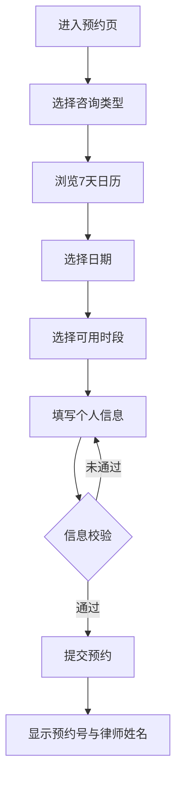

## 1. 产品概述

社区律师公益咨询预约系统，为社区居民提供在线预约律师公益咨询服务。用户可选择咨询类型（劳动纠纷、婚姻家事、物业纠纷），查看未来 7 天可用时段，填写个人信息和问题摘要后提交预约，系统返回预约号和分配的律师姓名。

- 目标用户：社区居民，需法律咨询但经济条件有限的群体
- 核心价值：降低法律咨询门槛，实现线上预约、线下咨询的便捷流程

## 2. 核心功能

### 2.1 用户角色

| 角色 | 注册方式 | 核心权限 |
|------|----------|----------|
| 居民 | 无需注册 | 浏览时段、提交预约、查看预约结果 |

### 2.2 功能模块

1. **预约页**：咨询类型选择、日历时段选择、个人信息填写、预约提交与结果展示

### 2.3 页面详情

| 页面名称 | 模块名称 | 功能描述 |
|----------|----------|----------|
| 预约页 | 咨询类型选择 | 三种类型卡片式选择：劳动纠纷、婚姻家事、物业纠纷，单选互斥 |
| 预约页 | 日历时段选择 | 横向滚动日历展示未来 7 天，选中日期后展示该日可用时段（上午/下午 slot），支持单选 |
| 预约页 | 个人信息填写 | 姓名、手机号（带格式校验）、问题摘要（多行文本） |
| 预约页 | 提交与结果 | 点击提交后显示预约成功卡片，包含预约号和分配律师姓名 |

## 3. 核心流程

用户打开页面 → 选择咨询类型 → 浏览未来 7 天日历 → 选择具体日期 → 选择可用时段 → 填写姓名、手机、问题摘要 → 点击提交 → 显示预约成功结果（预约号 + 律师姓名）

## 4. 用户界面设计

### 4.1 设计风格

- **色调**：温暖稳重的法律主题色——深靛蓝(#1e3a5f)为主色，金棕(#c8956c)为强调色，奶白(#faf8f5)为背景
- **按钮风格**：圆角(12px)大按钮，主色填充，轻阴影
- **字体**：标题使用 Noto Serif SC 衬线体传递专业感，正文使用系统无衬线体
- **布局**：移动端优先，单列卡片式纵向布局，最大宽度 480px 居中
- **图标风格**：lucide-react 线性图标

### 4.2 页面设计概览

| 页面名称 | 模块名称 | UI 元素 |
|----------|----------|---------|
| 预约页 | 咨询类型选择 | 三张横向卡片，选中态带主色边框与勾选图标，未选中为浅灰背景 |
| 预约页 | 日历时段选择 | 顶部横向滚动7天日期条（星期+日期），选中日期下方展示该日时段网格（上午/下午分组） |
| 预约页 | 个人信息填写 | 标签+输入框纵向排列，手机号带格式校验提示，问题摘要为 textarea |
| 预约页 | 提交按钮 | 全宽主色圆角按钮，loading 态禁用 |
| 预约页 | 预约结果 | 居中弹窗/卡片，大号预约号，律师姓名，关闭按钮 |

### 4.3 响应式设计

- 移动端优先（375px 基准），最大宽度 480px 居中显示
- 触控优化：按钮最小 44px 点击区域，日历条支持左右滑动
- 桌面端居中展示，两侧留白

### 4.4 3D 场景指导

不适用
