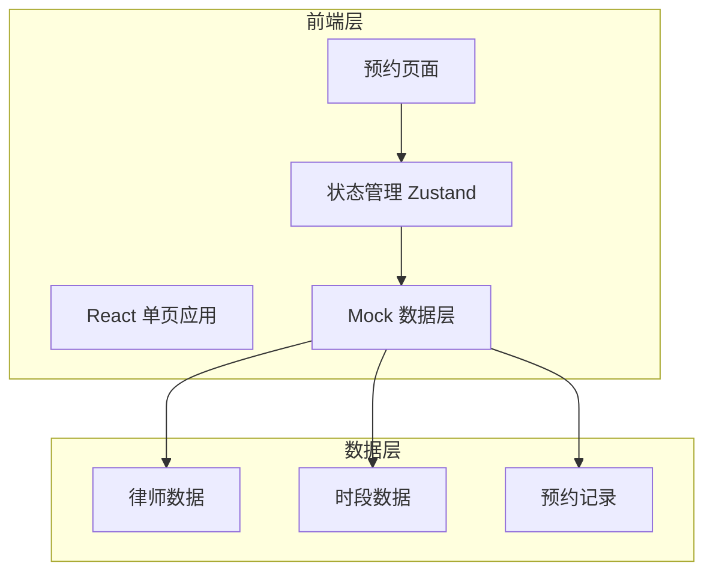
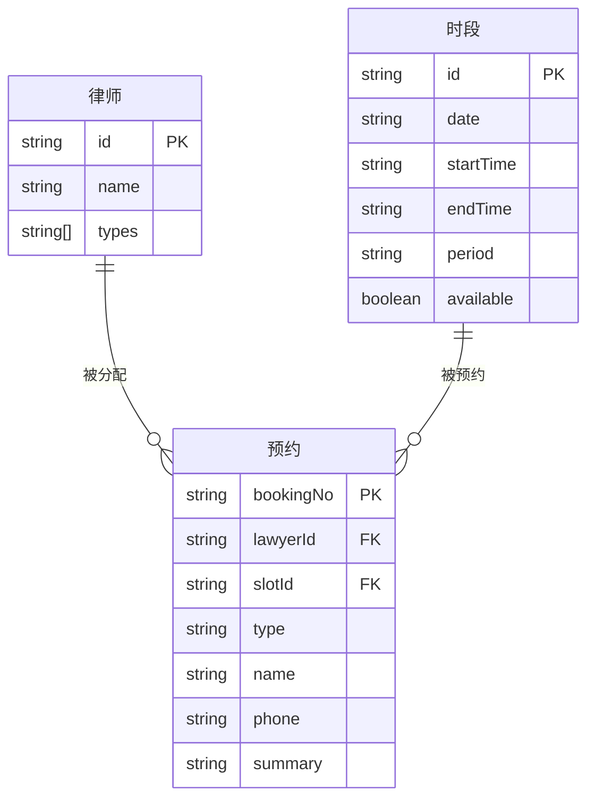

## 1. 架构设计



## 2. 技术说明

- **前端**：React@18 + TypeScript + Tailwind CSS@3 + Vite
- **初始化工具**：vite-init
- **后端**：无（纯前端 Mock 数据）
- **状态管理**：Zustand
- **路由**：React Router DOM（单页应用仅一个路由）
- **图标库**：lucide-react

## 3. 路由定义

| 路由 | 用途 |
|------|------|
| / | 预约主页，包含类型选择、日历时段、表单、结果展示 |

## 4. API 定义

本项目为纯前端，使用 Mock 数据模拟后端逻辑：

### 4.1 咨询类型

```typescript
type ConsultationType = 'labor' | 'marriage' | 'property'

interface TypeInfo {
  id: ConsultationType
  label: string
  icon: string
  description: string
}
```

### 4.2 可用时段

```typescript
interface TimeSlot {
  id: string
  date: string
  startTime: string
  endTime: string
  period: 'morning' | 'afternoon'
  available: boolean
}
```

### 4.3 预约提交

```typescript
interface BookingRequest {
  type: ConsultationType
  slotId: string
  name: string
  phone: string
  summary: string
}

interface BookingResult {
  bookingNo: string
  lawyerName: string
  date: string
  time: string
  type: string
}
```

## 5. 服务器架构图

不适用（纯前端项目）

## 6. 数据模型

### 6.1 数据模型定义



### 6.2 数据定义

使用前端 Mock 数据，不涉及数据库建表。
