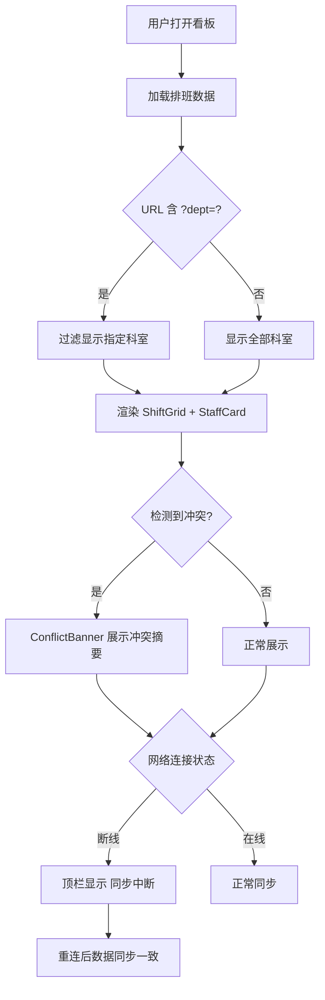

## 1. 产品概述

排班看板（Shift Board B816）是一个面向医院/工厂等需要多班次排班场景的实时排班管理看板，固定 1440×900 分辨率展示。

- 解决核心问题：排班冲突可视化、部门筛选、网络断连状态感知
- 目标用户：排班管理员、科室主任、人事部门

## 2. 核心功能

### 2.1 功能模块

1. **排班看板页**：排班网格、员工卡片、冲突横幅、部门筛选、同步状态

### 2.2 页面详情

| 页面名称 | 模块名称 | 功能描述 |
|----------|----------|----------|
| 排班看板 | ShiftGrid | 7天×24小时网格展示排班，冲突时段标红 |
| 排班看板 | StaffCard | 展示员工头像、姓名、班次信息，点击可查看详情 |
| 排班看板 | ConflictBanner | 顶部横幅，展示当前排班冲突数量与摘要 |
| 排班看板 | 部门过滤 | URL 参数 ?dept= 科室名 过滤显示对应科室排班 |
| 排班看板 | 同步状态 | 断线时顶栏显示「同步中断」红色提示，重连后数据一致 |

## 3. 核心流程

用户打开看板 → 自动加载排班数据 → URL ?dept= 过滤科室 → 冲突时段标红展示 → 断线顶栏提示「同步中断」→ 重连后自动同步数据保持一致

## 4. 用户界面设计

### 4.1 设计风格

- 主色调：深蓝灰 (#1a1f36) 背景 + 翠绿 (#00d68f) 正常班次 + 珊瑚红 (#ff4757) 冲突标记
- 按钮风格：圆角 8px，带微妙阴影
- 字体：Noto Sans SC / DM Sans，正文 14px，标题 18px
- 布局风格：左侧排班网格主区域，右侧员工列表面板
- 图标：lucide-vue-next 图标库

### 4.2 页面设计概览

| 页面名称 | 模块名称 | UI 元素 |
|----------|----------|----------|
| 排班看板 | 顶部栏 | 深色背景，同步状态指示灯，部门筛选下拉，冲突计数徽章 |
| 排班看板 | ShiftGrid | 7列(周一-周日) × 行(时段) 网格，正常绿/冲突红/空白灰 |
| 排班看板 | StaffCard | 卡片式，头像+姓名+班次标签，微动效 hover |
| 排班看板 | ConflictBanner | 红色渐变背景横幅，冲突数量+摘要，可折叠 |
| 排班看板 | 同步中断提示 | 顶栏红色闪烁条，「同步中断」文字 + 重试图标 |

### 4.3 响应式

- 桌面优先，固定 1440×900 设计
- 最小宽度 1280px 支持滚动

### 4.4 动效

- 冲突单元格脉冲红色边框动画
- 断线顶栏淡入淡出
- StaffCard hover 微上浮 + 阴影加深
- ConflictBanner 展开/折叠过渡
