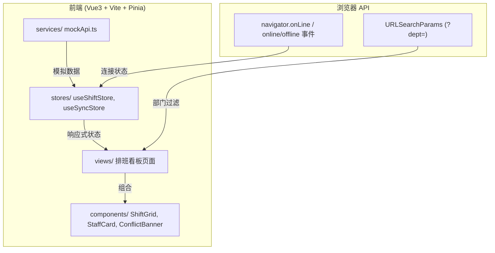

## 1. 架构设计



## 2. 技术说明

- 前端：Vue3 + Vite + Pinia + TypeScript + Tailwind CSS
- 初始化工具：vite-init (vue-ts 模板)
- 后端：无（纯前端，mock 数据）
- 数据库：无（mock 数据模拟）

## 3. 路由定义

| 路由 | 用途 |
|------|------|
| / | 排班看板主页面，支持 ?dept= 查询参数 |

## 4. 数据模型

### 4.1 核心类型定义

```typescript
interface Staff {
  id: string
  name: string
  avatar: string
  dept: string
  role: string
}

interface ShiftSlot {
  staffId: string
  day: number       // 0-6 周一至周日
  hour: number       // 0-23
  type: 'morning' | 'afternoon' | 'night' | 'off'
}

interface Conflict {
  id: string
  staffId: string
  day: number
  hour: number
  reason: string
}
```

## 5. 状态管理

### 5.1 useShiftStore (Pinia)

- shifts: ShiftSlot[] — 排班数据
- conflicts: Conflict[] — 冲突数据
- staffList: Staff[] — 员工列表
- currentDept: string — 当前筛选科室
- fetchShifts() — 加载排班数据
- filterByDept(dept: string) — 按科室过滤
- hasConflict(day, hour) — 判断某时段是否有冲突

### 5.2 useSyncStore (Pinia)

- isOnline: boolean — 网络连接状态
- lastSyncTime: number — 最后同步时间
- pendingUpdates: any[] — 断线期间待同步数据
- setOnline(status: boolean) — 设置连接状态
- queueUpdate(data: any) — 断线时队列化更新
- syncOnReconnect() — 重连后同步数据

## 6. 目录结构

```
apps/shift-b816/
├── src/
│   ├── views/
│   │   └── ShiftBoard.vue      # 排班看板主页面
│   ├── components/
│   │   ├── ShiftGrid.vue       # 排班网格组件
│   │   ├── StaffCard.vue       # 员工卡片组件
│   │   └── ConflictBanner.vue  # 冲突横幅组件
│   ├── stores/
│   │   ├── shiftStore.ts       # 排班状态管理
│   │   └── syncStore.ts        # 同步状态管理
│   ├── services/
│   │   └── mockApi.ts          # 模拟 API + 冲突检测
│   ├── App.vue
│   ├── main.ts
│   └── style.css
├── package.json
├── vite.config.ts
├── tsconfig.json
└── tailwind.config.js
```
