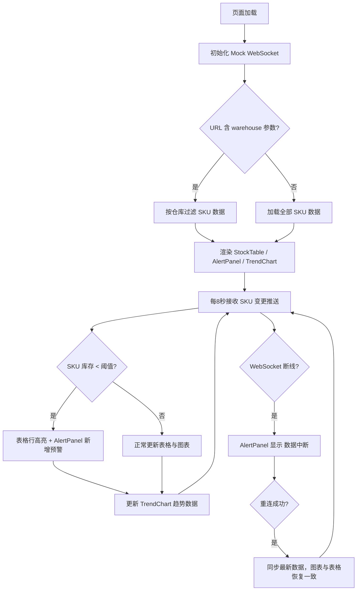

## 1. 产品概述

库存预警大屏（Inventory Alert Dashboard）是一款面向仓储管理人员的实时数据监控应用。通过模拟 WebSocket 推送，实现 SKU 库存数据的实时刷新与预警展示，帮助管理人员快速识别低库存风险并做出补货决策。

- 解决仓储运营中库存数据滞后、预警不及时的问题
- 目标用户：仓储运营主管、供应链管理人员

## 2. 核心功能

### 2.1 功能模块

1. **大屏主页面**：库存表格、预警面板、趋势图表三栏联动展示

### 2.2 页面详情

| 页面名称 | 模块名称 | 功能描述 |
|----------|----------|----------|
| 大屏主页面 | StockTable | 库存数据表格，低于阈值的 SKU 行高亮显示，支持仓库过滤 |
| 大屏主页面 | AlertPanel | 预警面板，实时展示低库存预警信息；断线时显示「数据中断」 |
| 大屏主页面 | TrendChart | ECharts 趋势折线图，展示库存变动趋势 |
| 大屏主页面 | WebSocket 模拟 | 每 8 秒推送 SKU 变更数据，支持断线/重连模拟 |
| 大屏主页面 | URL 过滤 | 支持 ?warehouse= 查询参数过滤指定仓库数据 |

## 3. 核心流程

## 4. 用户界面设计

### 4.1 设计风格

- 主色调：深色工业风（深蓝灰 #0f172a 为底，琥珀色 #f59e0b 为预警高亮，青绿 #06b6d4 为数据主色）
- 按钮/标签：圆角矩形，微光投影
- 字体：数据区等宽字体（JetBrains Mono），标题用 DM Sans
- 布局：大屏三栏布局（左：AlertPanel，中：StockTable，右：TrendChart）
- 图标风格：线性描边（Lucide React）

### 4.2 页面设计概览

| 页面名称 | 模块名称 | UI 元素 |
|----------|----------|----------|
| 大屏主页面 | StockTable | 深色表格，低于阈值行琥珀色高亮，行间交替底色 |
| 大屏主页面 | AlertPanel | 预警卡片列表，断线时顶部红色横幅「数据中断」 |
| 大屏主页面 | TrendChart | ECharts 深色主题折线图，渐变面积填充 |

### 4.3 响应式

- 桌面优先，大屏 1920×1080 最佳展示
- 中屏横向滚动适配
- 触控优化：表格行点击可展开详情
