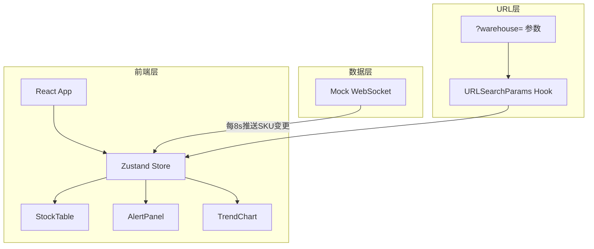

## 1. 架构设计



## 2. 技术说明

- 前端：React@18 + TypeScript + TailwindCSS@3 + Vite
- 初始化工具：vite-init（react-ts 模板）
- 图表：echarts@5 + echarts-for-react
- 状态管理：zustand
- 后端：无（纯前端 Mock 数据）
- 数据库：无（内存 Mock 数据）

## 3. 路由定义

| 路由 | 用途 |
|------|------|
| / | 大屏主页面（支持 ?warehouse= 查询参数） |

## 4. 数据模型

### 4.1 核心数据结构

```typescript
interface SKUItem {
  id: string
  name: string
  warehouse: string
  stock: number
  threshold: number
  updatedAt: number
}

interface AlertItem {
  id: string
  skuId: string
  skuName: string
  warehouse: string
  currentStock: number
  threshold: number
  timestamp: number
}

interface TrendPoint {
  timestamp: number
  skuId: string
  stock: number
}

interface WSMessage {
  type: 'update' | 'connected' | 'disconnected'
  payload: SKUItem | null
}
```

## 5. 项目结构

```
apps/inventory-b817/
├── src/
│   ├── components/
│   │   ├── StockTable.tsx
│   │   ├── AlertPanel.tsx
│   │   └── TrendChart.tsx
│   ├── hooks/
│   │   ├── useMockWebSocket.ts
│   │   └── useWarehouseFilter.ts
│   ├── store/
│   │   └── useInventoryStore.ts
│   ├── mock/
│   │   └── data.ts
│   ├── App.tsx
│   ├── main.tsx
│   └── index.css
├── package.json
├── vite.config.ts
├── tsconfig.json
└── tailwind.config.js
```

## 6. 关键实现要点

### 6.1 Mock WebSocket

- 使用 `setInterval` 每 8 秒生成随机 SKU 变更
- 模拟断线：随机间隔触发 `disconnected` 事件
- 重连后推送全量数据，确保图表与表格一致

### 6.2 仓库过滤

- 读取 `window.location.search` 中 `warehouse` 参数
- Zustand selector 中过滤 SKU 和预警数据

### 6.3 断线与重连

- AlertPanel 监听 `isConnected` 状态
- 断线时显示红色「数据中断」横幅
- 重连时后端推送全量快照，前端用快照替换增量数据
